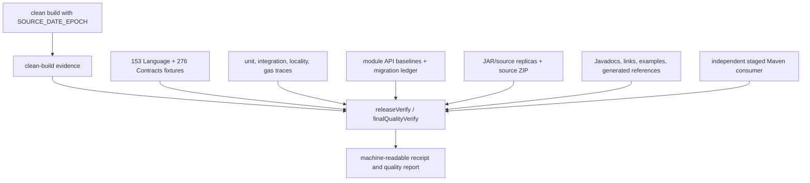

# Conformance and release architecture

The release gate binds source, specifications, registries, gas manifest,
fixtures, APIs, artifacts, tests, examples, documentation, and benchmark
compilation into one reproducible receipt.



## Exact package binding

The conformance artifact contains the released specifications, registry/gas
packages, and exact fixture manifests. Every manifest entry binds path, bytes,
and SHA-256. Release conformance fails on missing, extra, changed, or skipped
fixtures. Runtime modules do not contain fixture harnesses.

## Reproducibility

The first invocation runs an exclusion-free `clean build` and records the Git
commit, complete source identity, task paths, and normalized
`SOURCE_DATE_EPOCH`. A second invocation verifies the marker against the same
source and epoch. JARs and source archives use normalized timestamps and stable
entry order; independent replicas must be byte-identical. The complete source
release ZIP is checked against an exact entry manifest and checksum.

## Published behavior

Seven publications first enter a disposable invocation-owned Maven repository.
The release lane then copies only each exact POM, runtime JAR, sources JAR and
Javadoc JAR into a separate non-overwriting dependency repository. Every copied
file has a SHA-256 companion. The root `artifact-manifest.json` binds those
paths and hashes to the source commit, Contracts specification identity,
Contracts fixture-package identity and Contracts release identity. The
manifest deliberately excludes its own byte identity; the adjacent
`artifact-manifest.json.sha256` and downstream receipts bind that value without
self-reference.

A separate consumer build has no `includeBuild`, project substitution or Maven
Local. Gradle resolves the `blue.language` group exclusively from this sealed
repository, with no remote fallback. It enforces Java 8 bytecode and allowed
POM edges and exercises the aggregate and conformance entry points. The
disposable publication task may delete only `build/staging-deploy`; it never
deletes or overwrites the repository already handed to a downstream consumer.
Create an explicit handoff repository with:

```bash
./gradlew assembleImmutableStagedRepository \
  -PstagedDependencyRepository=/absolute/path/to/contracts-maven-repository
```

The destination must be outside `build/staging-deploy`. If it already exists,
the task succeeds only when its complete file tree is byte-identical; otherwise
it fails without changing the destination. A downstream build receives that
absolute path and must not invoke the Contracts `clean`, publication or staging
tasks. `publishedArtifactSmoke` applies the same repository property and proves
that all `blue.language` coordinates resolve from the handoff repository only.

## Evidence is fail-closed

Reports are generated from declared task outputs, never broad stale build
directory discovery. Missing JUnit XML, skipped fixtures, stale generated
references, dirty source, a changed epoch, or absent artifact evidence makes a
release ineligible. Capturing a semantic or API baseline is a deliberate
manual task and never a dependency of verification.

The contributor commands are in [docs/developer-process.md](../developer-process.md).
