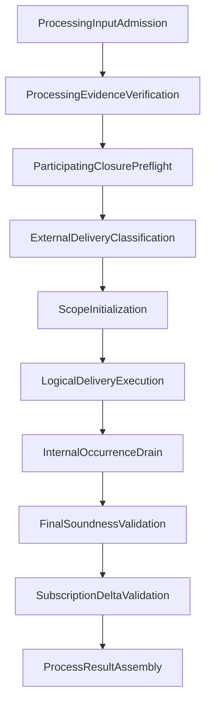

# Contracts Processing Pipeline

`ProcessorEngine` is a composition root for deterministic phases. Each phase
receives an immutable phase state, admits its own named gas before work, records
explicit provider demands, and either returns the next state or crosses one
deterministic failure boundary.

## Admission and evidence

Input admission verifies exact Root/event handles and reserved state without
mutating the document. Evidence verification derives or checks a revision-
complete delivery plan. Resource unavailability suspends `processAttempt`;
invalid evidence completes with a deterministic noncommitting failure.

## Preflight and classification

The participating closure is frozen, all effective contract types in it are
recognized, and dispatch headers are snapshotted before the first mutation.
Executable bodies remain cold. External classification evaluates source
acceptance, checkpoint freshness, same-scope target selection, payload identity,
and logical-delivery grouping.

## Tentative execution

Initialization, Handler execution, internal FIFO drain, patches, emitted
occurrences, lifecycle state, and pending checkpoints are coordinated by one
invocation-owned `ProcessingSession`. Active-scope cut-off is checked after
nested cascades and before writes.

## Validation and publication

Final soundness rechecks the specification-defined evidence and protected state
against the tentative Root. Subscription delta validation proves that affected
before/after branches remain finitely indexable. Result assembly publishes one
Root and Root-only events on success, or rolls all tentative effects back on a
closed non-success status. The admitted gas prefix is retained in either case.

Component tests exercise every phase without constructing the whole engine;
end-to-end fixtures pin ordering, identities, diagnostics, and exact gas traces.
