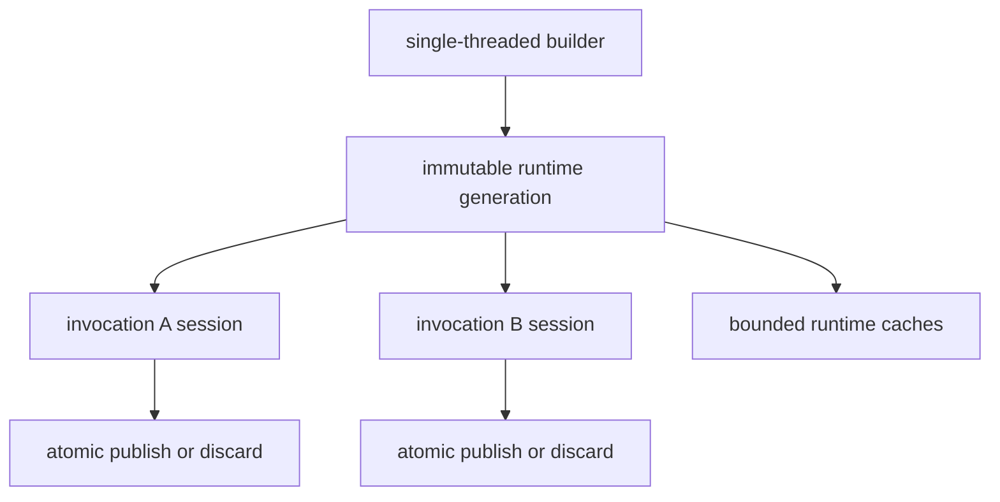

# Immutability and runtime state

Mutable authoring values and immutable runtime values have separate ownership
rules.

| Value | Mutability | Owner |
| --- | --- | --- |
| `Node`, `Schema` | mutable | caller; semantic APIs do not retain or mutate them |
| `FrozenNode` | immutable | freely shareable |
| `ResolvedSnapshot` | immutable handle over frozen canonical/resolved roots | runtime or caller |
| runtime registry/configuration | immutable after build | built runtime generation |
| caches | internally mutable, semantically transparent and bounded | Language/Contracts runtime |
| processing session | invocation-local mutable transaction | one `PROCESS` call |

A semantic operation first admits its inputs, then operates on frozen or
defensive values. Accessors that return `Node` materialize detached copies.
Persistent patches rebuild the changed path and ancestor spine; unchanged
frozen siblings can remain reference-identical.

Closing a runtime rejects new work, waits for admitted work where the public
lifecycle contract requires it, clears owned caches, and is idempotent. A
runtime never closes a borrowed provider, mapper, registry, processor
extension, or observer. A callback must not reenter close from its own admitted
operation.

Contracts state uses the transaction described in
[transactional-state.md](transactional-state.md). Gas differs from application
state: admitted charges remain in a noncommitting result because they describe
work already performed.
