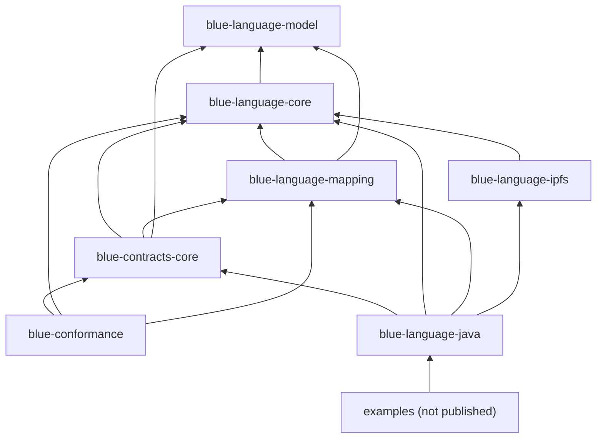

# Modules and dependencies

The repository uses conventional physical source roots. No published package
is split across modules, and the observed dependency graph must remain
acyclic.

| Artifact | Owns | Must not own |
| --- | --- | --- |
| `blue-language-model` | `Node`, `Schema`, wire values and annotations | providers, engines, Contracts, HTTP |
| `blue-language-core` | Language semantics, provider SPI, snapshots | Contracts, fixture harnesses, classpath scanning, HTTP |
| `blue-language-mapping` | Java object mapping and optional discovery | Language algorithms or Contracts processing |
| `blue-language-ipfs` | CID conversion and HTTP-backed IPFS provider | core semantics |
| `blue-contracts-core` | generic Contracts API, SPI, gas, processor | application ecosystems or conformance fixtures |
| `blue-conformance` | exact fixture engines, reports, release CLI | privileged access to runtime internals |
| `blue-language-java` | composition roots and thin convenience facade | duplicated algorithms |
| `examples` | compiled programs used by guides and tests | production runtime code |

The included `build-logic` build owns Java 8 conventions, API baselines,
archive reproducibility, conformance execution, release evidence, published
smoke tests, documentation checks, and final quality reporting. The root
project is a verification orchestrator and publishes no phantom artifact.

Published smoke tests resolve all seven staged Maven coordinates in an
independent build with no composite substitution. This proves that POM edges,
transitive dependencies, bytecode level, and aggregate entry points work for a
real consumer.

See [ADR 0007](../adr/0007-module-boundaries.md) for the decision and the
generated module graph in [reference/packages.md](../reference/packages.md).
