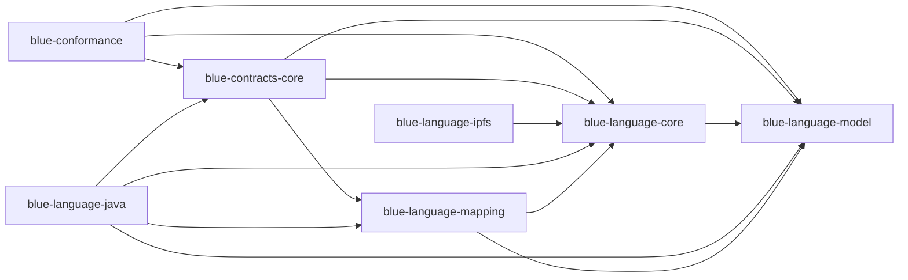

# Modules and dependencies

<!-- Generated by :generateDocumentationReferences; do not edit manually. -->

Schema: `blue-language-java-generated-documentation/1.0`.

This graph is generated from compiled ownership inventories. An arrow means the source module references the target module.

| Source module | Target module |
| --- | --- |
| `blue-conformance` | `blue-contracts-core` |
| `blue-conformance` | `blue-language-core` |
| `blue-conformance` | `blue-language-model` |
| `blue-contracts-core` | `blue-language-core` |
| `blue-contracts-core` | `blue-language-mapping` |
| `blue-contracts-core` | `blue-language-model` |
| `blue-language-core` | `blue-language-model` |
| `blue-language-ipfs` | `blue-language-core` |
| `blue-language-java` | `blue-contracts-core` |
| `blue-language-java` | `blue-language-core` |
| `blue-language-java` | `blue-language-mapping` |
| `blue-language-java` | `blue-language-model` |
| `blue-language-mapping` | `blue-language-core` |
| `blue-language-mapping` | `blue-language-model` |

Module cycles: **0**; split packages: **0**; undeclared edges: **0**.
