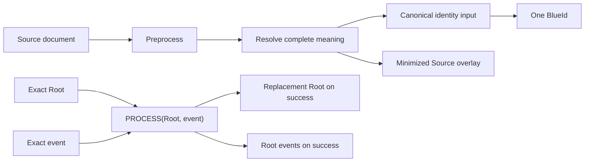

# Architecture overview

Blue is a content-addressed graph. Java `Node` objects are mutable authoring
and transport values, while admitted runtime state is represented by immutable
`FrozenNode` graphs and `ResolvedSnapshot` handles. All semantic operations
copy or freeze inputs before retaining them.

## Layers

1. The model defines the JSON-shaped value vocabulary and wire rules.
2. Language core verifies provider evidence and implements preprocessing,
   graph operations, resolution, identity, snapshots, matching, and patching.
3. Mapping and IPFS are optional integrations over public Language boundaries.
4. Contracts binds an immutable runtime registry and executes explicit
   deterministic phases over Language snapshots.
5. Conformance executes the exact released fixture packages through public
   APIs and produces release evidence.
6. The aggregate artifact composes the focused services; it contains no
   independent semantic algorithm.

## Determinism boundary

For the same exact Root, event, provider evidence, runtime registry, gas
manifest, and portable-limit manifest, every implementation must produce the
same status, Root, ordered Root events, diagnostic data, semantic demand, and
gas trace. Backend calls, batches, bytes, timings, threads, cache hits, and
observer output are operational and cannot enter that decision.

## Ownership

Builders are mutable single-threaded configuration scopes. Built runtimes are
immutable generations. Runtime-owned caches are bounded and cleared on close;
borrowed providers, registries, mappers, and observers are not closed. Each
Contracts call creates an invocation-owned session and publishes nothing until
its final commit check succeeds.

Continue with [modules and dependencies](modules-and-dependencies.md), then the
[Language pipeline](language-pipeline.md) and
[Contracts pipeline](contracts-pipeline.md).
