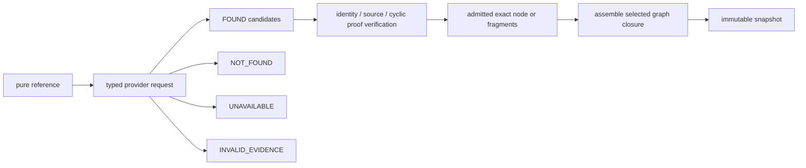

# Provider and fragment model

A provider reports evidence availability; the Language verification boundary
decides what that evidence proves.

`NOT_FOUND` is a definitive transport answer, not proof that a semantic field
is absent. `UNAVAILABLE` says the answer cannot currently be established.
`INVALID_EVIDENCE` is deterministic for the supplied candidate/proof. Only a
verified complete exact value can establish semantic presence or absence.

Exact fragments are ordinary Blue nodes. Replacing an inline subtree with a
pure reference to that subtree's BlueId preserves the Root BlueId. The runtime
opens only the closure demanded by preprocessing, resolution, matching, or the
selected Contracts phases. Selected executable bodies load after handler
selection; unrelated bodies and branches remain cold.

Provider calls, batching, backend bytes, cache hits, and storage fragment size
are physical metrics. The logical demand set, status, diagnostic, gas trace,
and resulting Root cannot depend on them. A warm cache may remove I/O but must
not remove a semantic demand record.

Finalized cyclic members require the owning set proof. An ordinary provider
cannot validate `setBlueId#index` by hashing a standalone member. See
[Cyclic sets](../guides/cyclic-sets.md) and
[Providers and evidence](../guides/providers-and-evidence.md).
