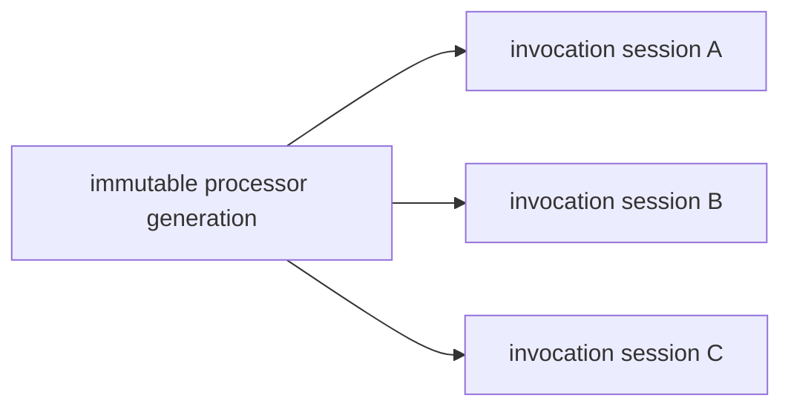

# Thread Safety And Ownership

A processor built through the modern builder is an immutable generation. The
builder snapshots the runtime registry and configuration; later mutation of the
builder or source registry cannot change an already built processor.

```java
DocumentProcessor processor = DocumentProcessor.builder()
        .nodeProvider(provider)
        .runtimeRegistry(registry)
        .gasSchedule(schedule)
        .gasLimit(limit)
        .deliveryPlanDeriver(deriver)
        .evidenceVerifier(verifier)
        .subscriptionSurfaceValidator(surfaceValidator)
        .snapshotStore(snapshotStore)
        .observer(observer)
        .cachePolicy(cachePolicy)
        .build();
```

Create a new processor generation to change any semantic collaborator. Do not
mutate a live generation or protect arbitrary reconfiguration with a global
read/write lock.



Every call creates its own `ProcessingSession`, gas meter, evidence view,
contract caches, event queue, lifecycle state, mutation transaction, and output
collector. Invocation-local objects are never reused across calls.

Shared collaborators must satisfy their declared contract:

- providers and snapshot stores return immutable or defensive exact values;
- registered contract processors are stateless or internally thread-safe;
- delivery/evidence/subscription functions are deterministic and do not consult
  mutable ambient state;
- observers may coordinate operational recording but cannot influence semantic
  decisions or gas;
- cache policy bounds processor-owned caches; cache hits cannot alter results.

Configuration produces a new immutable processor generation. Concurrency tests
process distinct inputs through one generation and compare results,
diagnostics, events, demands, and gas traces with serial execution.
