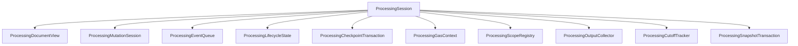

# Transactional State

One `ProcessingSession` owns all mutable invocation state. Its components expose
focused operations but share one commit decision.

## Document and snapshot ownership

`ProcessingDocumentView` exposes path-local exact, resolved, and canonical
reads. `ProcessingSnapshotTransaction` owns invocation-local snapshot caches and
publishes them only after commit. Provider materialization is verified at the
exact BlueId boundary.

## Mutation

`ProcessingMutationSession` parses and preflights patches, applies persistent
copy-on-write changes, rebuilds only changed spines, compares processor-
protected state, generalizes effective types, and constructs exact Document
Updates. Missing parents are not synthesized implicitly. A patch below an
opaque cyclic member fails before provider demand.

## Events, scopes, and lifecycle

The queue owns immutable occurrences and FIFO sequence. The scope registry owns
participation and frozen propagation chains. Lifecycle and cut-off components
ensure that a replaced occurrence cannot receive later effects or resurrect at
the same path. The output collector admits only Root emissions.

## Checkpoints and commit

The checkpoint transaction merges every pending raw-source/domain update into
the current tentative marker and emits one canonical final state. No component
writes directly to the committed Root. On success, mutation, snapshots,
checkpoints, lifecycle markers, and outputs commit together; otherwise they are
discarded together.

Gas is intentionally different: charges are admitted before work and remain an
observable trace even when semantic state rolls back.
