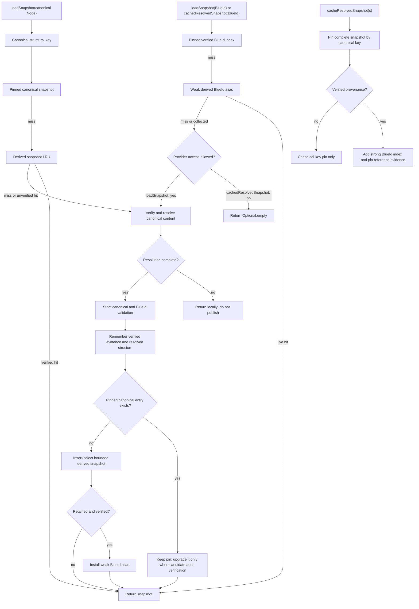

# `Blue` facade: developer overview and complete method reference

## Scope and methodology

This document describes the final
[`Blue.java`](../src/main/java/blue/language/Blue.java) facade surface. The main
inventory contains **109 live outer public declarations**: six constructors,
the static `withCachePolicy` factory, and 102 other methods. Constructors,
overloads, deprecated methods, and `AutoCloseable.close()` are counted
separately. Historical numbering slots 15–16 remain reserved for two removed
`reverse(...)` overloads, so the final live entry is numbered 111.

The internal appendix is a design-oriented navigation map rather than an
exhaustive declaration count. Its declaration names and IDs are durable;
search [`Blue.java`](../src/main/java/blue/language/Blue.java) by exact
signature after implementation changes.

The usage notes report direct calls from the currently compiled
`src/test/java` bytecode. Bytecode descriptors were used so overloaded methods
are attributed to the exact signature; lambda bodies are included, and nested
test classes are reported under their outer class. Names are relative to
`src/test/java/blue/language` unless a package prefix is shown. Test-support and
sample classes are identified as such. “No direct test caller found” means
exactly that: a wrapper, suite, or lower-level component may still exercise the
behavior indirectly, and important indirect paths are called out.

## Developer overview

### Blue Language and Blue Contracts are different layers

Blue Language is the deterministic document layer. It defines nodes, types,
references, schema constraints, list controls, canonical content, and BlueId
identity. Its four conceptual transformations are:

```text
expand  <-> collapse
resolve <-> minimize
```

- **Expand/collapse** exchange pure `{blueId: ...}` references and referenced
  content. Expansion materializes references; collapse produces a content
  reference.
- **Resolve/minimize** exchange authored overlays and completed meaning.
  Resolution applies type inheritance, reference resolution, merge processors,
  limits, and validation. Minimization removes state derivable from types while
  preserving an overlay that resolves back to the same meaning.

Canonicalization is related to minimization but is not its synonym.
`canonicalize` retains source provenance needed for strict Content BlueId
identity; `minimize` produces a compact author-facing overlay. Likewise,
`calculateBlueId` hashes already valid structural content, while
`calculateSemanticBlueId` first canonicalizes meaning so redundant authored
forms can converge.

Blue Contracts and Processor 1.0 is a runtime layered on those language
semantics. It selects an immutable resolved Processing Document, recognizes
contracts, routes events through channels and handlers, applies tentative
patches, accounts for gas and portable limits, manages checkpoints and
lifecycle, and commits only a valid result. The facade exposes both layers, but
language operations such as `resolve` do not themselves run contracts, and
`processDocument` is not another spelling of language resolution.

### The transformation and runtime pipeline

```text
authored YAML/JSON
    -> raw parse (`parseSource*`)
    -> preprocessing (`blue` directive, aliases, Default Blue)
    -> resolution (provider references, type merge, schema/list semantics)
    -> canonical overlay + resolved runtime view
    -> immutable `ResolvedSnapshot`
    -> BlueId / canonical patching / contract processing
```

`yamlToNode` and `jsonToNode` combine raw parsing with preprocessing.
`parseSourceYaml` and `parseSourceJson` deliberately stop before preprocessing.
The basic `resolve(Node...)` overloads also do **not** preprocess: callers that
construct raw nodes must invoke `preprocess`, whereas `canonicalize`,
`minimize`, and `resolveToSnapshot` perform preprocessing internally.

A `ResolvedSnapshot` keeps two immutable `FrozenNode` graphs together:

- the **canonical root**, which is the minimized identity/storage source; and
- the **resolved root**, which is the completed runtime read/conformance view.

The snapshot BlueId belongs to the canonical root. Snapshot APIs are therefore
the preferred boundary for repeated processing and patching, while mutable
`Node` remains convenient for parsing and authoring.

### Method groups

| Numbered entries | Group | What the group owns |
| ---: | --- | --- |
| 1–7 | Runtime construction | Provider, merger, Java type mapping, bounded cache policy, and owned default processor setup |
| 8–32 | Language transformations | Resolve, preserve/select, canonicalize/minimize, expand/collapse, limited operations, and snapshot loading |
| 33–44 | Canonical patches and caches | Immutable patch entry points, authoritative snapshot pinning, bounded derived caches, statistics, and invalidation |
| 45–51 | Conformance | Language/Contracts version metadata, fixture reports, isolated engines, and suite execution |
| 52–59 | Extension, conversion, matching, limits | In-place reference extension, Java conversion, type matching, and global resolution limits |
| 60–85 | Parsing, export, dictionaries, identity | YAML/JSON boundaries, dictionary-aware export, cloning, and structural/semantic BlueIds |
| 86–101 | Preprocessing and Contracts runtime | Aliases, processor/type registration, document initialize/process operations, and object/type bridges |
| 102–111 | Configuration and lifecycle | Runtime dependencies, fluent reconfiguration, defensive configuration views, and close semantics |

### Important operational distinctions

- A `NodeProvider` supplies content-addressed canonical evidence. `Blue` wraps
  it and verifies/materializes references; replacing it invalidates reloadable
  state.
- Explicitly cached snapshots are authoritative and pinned. Derived snapshots,
  aliases, reference materializations, structural interns, and processor plans
  are acceleration data bounded by `BlueCachePolicy`.
- Path-preserving APIs defer or exclude selected resolution work; they are not
  equivalent to deleting fields before resolution.
- `parseBlueIdInput*` validates strict identity input. Ordinary source parsers
  accept source-language constructs intended to be preprocessed.
- Injected `DocumentProcessor` instances are borrowed. Processors created by
  `Blue` are owned and closed by it.
- Closing a runtime releases owned caches and processors and rejects later
  runtime work. Pure serialization helpers that do not enter runtime admission
  remain usable, as documented by `close()`.

### Caching process

#### Mental model: authority, evidence, and acceleration

`Blue` does not have one undifferentiated cache. It separates retained state by
what that state is allowed to prove:

1. **Caller-authoritative state** is explicitly pinned by
   `cacheResolvedSnapshot(s)`. It is not evicted by `BlueCachePolicy`.
2. **Verified shared evidence** is content whose canonical form has been
   checked against its BlueId. Unpinned evidence is bounded; evidence attached
   to an explicit pin is retained with that pin.
3. **Transient working state** belongs to one processing operation or
   working-document sequence. Verified discoveries and structural graphs may
   be reused within that scope. Legacy transient-trusted compatibility
   operations fail closed and retain no content.
4. **Derived acceleration data** consists of resolved snapshots, weak BlueId
   aliases, immutable subtree interns, and processor plans. Losing it may make
   the next operation slower, but must not change the language result.

This separation is central to Blue's content-addressed model. A structural
match is useful for reuse, but it is not proof that a provider supplied the
content addressed by a BlueId. Similarly, strict canonical/BlueId validation
is not the same as provider provenance. The implementation therefore keeps
canonical structural keys, verified-reference evidence, and BlueId indexes as
related but distinct concepts.

All cache ownership is per `Blue` runtime. `BlueCachePolicy` is not a
process-wide memory budget, and its weights are approximate retained-memory
estimates rather than heap measurements. The standard bounded policy uses:

| Family | Default entry bound | Default weight bound | Default maximum single entry |
| --- | ---: | ---: | ---: |
| Derived snapshots | 128 | 64 MiB | 16 MiB |
| Canonical/BlueId aliases | 256 | 16 MiB | 512 bytes for the weak-alias entry |
| Resolved structural interns | 8,192 | 64 MiB | 16 MiB |
| Unpinned verified references in root and transient scopes | 2,048 | 32 MiB | 16 MiB |
| Each physical processor-plan cache | 4,096 | 32 MiB | 16 MiB |

`lowMemoryDefaults()`, `highThroughputDefaults()`, and a custom builder alter
those bounds. `BlueCachePolicy.disabled()` prevents retained reloadable shared
acceleration data, but does not prevent temporary objects/scopes needed to
perform an operation and does not disable explicit pins.

Shared snapshot publication follows these invariants:

- only **resolution-complete** snapshots may enter the shared snapshot caches;
- the canonical root is made strict-canonical and strict-BlueId-valid before
  publication;
- a cached snapshot with verified provenance is preferred over a structurally
  equal candidate without it;
- a BlueId alias is installed only for a retained derived snapshot that carries
  verified-reference provenance; and
- eviction or an oversized-entry rejection affects retention, not the value
  returned by the operation that produced the snapshot.

#### Normal snapshot lookup and publication

The canonical and BlueId lookup routes deliberately use different indexes:



The important public-method differences are:

- `resolveToSnapshot(Node/Object)` preprocesses and resolves first. Reference
  resolution can reuse verified entries and structural interns, and the
  completed top-level result is then de-duplicated/published as a derived
  snapshot.
- `loadSnapshot(Node)` first checks the canonical structural indexes. It only
  accepts a cache hit as a load result when the snapshot carries verified
  reference resolution; otherwise it verifies and resolves the supplied
  canonical content.
- `loadSnapshot(String)` checks the strong pinned BlueId index, then the weak
  derived alias, then fetches provider content on a miss.
- `cachedResolvedSnapshot(String)` uses the same BlueId indexes but never
  consults the provider.
- `applyCanonicalPatch(ResolvedSnapshot, JsonPatch)` re-resolves the patched
  canonical root and can reuse or publish a snapshot. In contrast,
  `canonicalPatchEngine(Node)` and `applyCanonicalPatch(Node, JsonPatch)` are
  pure canonical patch operations and do not populate snapshot caches.
- `resolveToSnapshotPreservingPaths(...)` builds with a one-shot transient
  reference child and does not publish its result to shared snapshot caches.
  Non-empty preserved paths can make the result deferred; an empty selection
  can produce a complete result. Only a complete result may later be
  explicitly pinned.
- The ordinary `resolve`, canonicalization, minimization, and semantic-BlueId
  routes can reuse verified references and immutable structures without
  necessarily creating a top-level `ResolvedSnapshot` cache entry.
  `expand`/`expandLimited` use direct provider expansion, and `resolveLimited`
  deliberately uses no `ResolvedReferenceCache`, so budgeted partial work does
  not become shared verified evidence.

#### Processing is a scoped cache transaction

Document processing adds a transaction-like boundary around those same
caches:

1. `processDocument(...)` or `initializeDocument(...)` admits the operation
   and captures the active processor owner token, runtime cache generation,
   provider, merger, aliases, and limits.
2. The processor snapshot manager first tries
   `recentProcessingSnapshots`, keyed by the exact resolved structure of the
   selected Processing Document.
3. On a miss, resolution and patch planning run in a transient child
   `ResolvedReferenceCache`. The child can read shared verified evidence but
   keeps newly discovered verified references and structural interns local.
4. A reusable working sequence can fork that child and prune entries no longer
   reachable from its current canonical/resolved graph.
5. A complete final snapshot is published only if both the runtime generation
   and transient reference generation are still current. Before publication,
   only verified references reachable through the final canonical root,
   including transitive verified dependencies, are promoted. Evidence used
   only by discarded intermediate states remains local; unverified candidates
   are never retained.
6. The completed result is also remembered under the selected document's
   structural key for near-term processor reuse.

Facade-admitted work and retained/direct processor work take different
invalidation paths. Reconfiguration blocks new facade admission, waits for
already admitted facade work to finish, and then clears any reloadable result
that work published. A publication also carries a
`(processor owner token, generation)` stamp. That second defense suppresses
late publication by retained/direct processor handles or transient sequences
that are outside the facade's admission count after configuration rotates the
token and/or generation.

#### The constants, one by one

There are nine constants in the question, but only the first is a numeric
behavioral limit. The other eight are stable logical region names used by
`BlueCacheStats` and, where instrumented, `ProcessingMetricsSink`. A logical
region is not necessarily one physical map.

##### `RECENT_PROCESSING_DOCUMENT_SNAPSHOT_LIMIT = 32`

This is the hard entry cap for the recent selected-document locality window.
The actual entry bound is:

```text
min(32, cachePolicy.derivedSnapshotMaxEntries())
```

The cache also uses the derived-snapshot total-weight and maximum-entry-weight
bounds. Thus standard low-memory, bounded, and high-throughput profiles still
cap this region at 32 entries; a smaller custom derived bound lowers it, and
the disabled policy lowers it to zero. It is intentionally not an unbounded
document history or audit log.

`cachedProcessingSnapshotFor`, `selectedStructuralKey`, and
`recentProcessingSnapshot` implement lookup. `rememberProcessingSnapshot`
stores only complete results under a current generation. The process and
initialize overloads reach those helpers through the processor snapshot
manager and published-result remember path.

No current test isolates a successful recent-processing-cache hit. Lifecycle
and generation-barrier coverage is concentrated in `BlueCacheLifecycleTest`,
especially
`shouldSkipReloadableRetentionWhenCachingIsDisabled`,
`shouldKeepExplicitPinsWhenCachingIsDisabled`,
`shouldPreventDisplacedProcessorFromPublishingSnapshotAfterProviderReplacement`,
`shouldRejectLateBorrowedProcessorPublicationAfterExplicitClear`, and
`shouldWaitForAdmittedOwnedProcessingAndReleaseItsPublicationWhenClosing`.

##### `PINNED_SNAPSHOT_CACHE = "pinnedAuthoritativeSnapshots"`

This region represents the caller-authoritative snapshot tier. Physically,
`Blue` has two strong concurrent indexes:

- canonical `ResolvedStructuralKey -> ResolvedSnapshot`; and
- verified `BlueId String -> ResolvedSnapshot`.

`cacheResolvedSnapshot` and `cacheResolvedSnapshots` are the only public
methods that create a pin. `pinSnapshot` requires a complete snapshot, makes
its canonical form publishable, prefers verified provenance when an equivalent
entry already exists, removes the equivalent derived entry/weak alias, and
updates observed retained weight.

Pinned does **not** mean provider-verified. A complete snapshot without
`verifiedReferenceResolution` can be pinned by canonical structure, but it
does not receive the strong BlueId index and cannot certify reference content.
When verified evidence is present, its reference entry is pinned as well.

This tier has no policy eviction and survives reloadable configuration
changes. It is removed by `clearResolvedSnapshotCache()` or `close()`. The
region's entry count is the canonical index count; the secondary BlueId index
is not double-counted.

Representative tests are
`BlueCacheLifecycleTest.shouldKeepPublicAuthoritativeSnapshotPinnedAcrossDerivedEviction`,
`shouldPreserveCallerPinnedAuthoritativeContentAcrossConfigurationRefresh`,
`shouldKeepExplicitPinsWhenCachingIsDisabled`, and
`shouldPromoteReferenceEvidenceWhenReplacingPinnedSnapshotWithVerifiedSnapshot`,
plus
`DeferredSnapshotCacheIsolationTest.shouldRejectPinningDeferredSnapshotAsAuthoritative`.

##### `DERIVED_SNAPSHOT_CACHE = "derivedResolvedSnapshots"`

This is a synchronized weighted access-order LRU from canonical
`ResolvedStructuralKey` to complete `ResolvedSnapshot`. It is populated by
ordinary snapshot publication from `resolveToSnapshot`, `loadSnapshot`,
snapshot patching, and committed processor snapshot-manager work.

`cachedSnapshotByCanonical` checks the pinned canonical map first and then this
LRU. `cacheSnapshot` and `cacheSnapshotLocked` enforce complete/strict
publication, remember verified and structural evidence, select the best
existing representation, and insert it. `preferVerified` keeps the current
entry unless the candidate is the one that adds verified provenance.

The region is bounded simultaneously by derived entry count, total estimated
weight, and maximum single-entry weight. An oversized snapshot is still
returned to the current caller; it is merely rejected from retained derived
state. Pinning an equivalent snapshot removes the derived copy.

Representative tests are
`BlueCacheLifecycleTest.shouldBoundDerivedSnapshotsWithoutChangingReloadIdentity`,
`shouldUseButNotRetainOversizedDerivedSnapshotAndStillAllowPinning`, and
`shouldSkipReloadableRetentionWhenCachingIsDisabled`, plus
`ResolvedSnapshotTest.shouldCacheResolvedSnapshotByBlueIdAndReuseFrozenRootsWhenLoadingSnapshot`
and
`ProcessingSnapshotProviderPatchTest.shouldVerifySequentialIntermediateStatesUseBlueTransientResolutionAndOnlyPublishTheFinalSnapshot`.

##### `CANONICAL_ALIAS_CACHE = "canonicalAliases"`

Despite the name, this region has nothing to do with preprocessing aliases.
It is a bounded access-order LRU from BlueId string to a
`WeakReference<ResolvedSnapshot>`. The canonical structural cache remains the
primary owner and identity index.

`putDerivedBlueIdAlias` creates an alias only after the derived canonical cache
actually retained a snapshot with verified-reference provenance.
`cachedSnapshotByBlueId`, used by `loadSnapshot(String)` and
`cachedResolvedSnapshot(String)`, checks the strong pinned BlueId map first and
then this weak index. Canonical-LRU eviction does not itself remove the weak
alias: it can still hit while some other strong reference keeps the snapshot
alive. Once no strong reference remains, garbage collection may clear the
target; lookup then removes the dead alias and reports a miss.

The alias cache uses its own entry/weight policy. Each weak alias is estimated
at 64 bytes and has a 512-byte maximum-entry cap (or a smaller runtime maximum
entry limit). It is removed on reloadable invalidation, full clear, close, or
promotion of that snapshot to a pin.

Representative behavior appears in
`ResolvedSnapshotTest.shouldCacheResolvedSnapshotByBlueIdAndReuseFrozenRootsWhenLoadingSnapshot`,
`RootReferenceSnapshotTest.shouldNotCertifyUnmaterializedContentFromRootReferenceSnapshot`,
and
`BlueCacheLifecycleTest.shouldSkipReloadableRetentionWhenCachingIsDisabled`.
There is no current test dedicated solely to alias eviction.

##### `RECENT_PROCESSING_CACHE = "recentProcessingSnapshots"`

This is the reporting/metrics name for the cache bounded by
`RECENT_PROCESSING_DOCUMENT_SNAPSHOT_LIMIT`. Physically it is a weighted
access-order LRU from the selected resolved document's
`ResolvedStructuralKey` to a complete snapshot.

It is not used by general `loadSnapshot` calls. The Blue-owned
`ProcessingSnapshotManager` reads it while selecting a snapshot for processor
work, and process/initialize result handling writes it. Both read and write
require a current generation stamp; a document that cannot be frozen to a
resolved structural key simply misses. It is cleared on every reloadable
invalidation, full clear, and close.

The representative tests are the recent-processing and generation-barrier
tests listed for the numeric limit above. No current test directly asserts the
processing hit/miss metric counters.

##### `VERIFIED_REFERENCE_CACHE = "verifiedReferences"`

This logical region belongs to `ResolvedReferenceCache`. Its primary map is:

```text
BlueId -> (strict verified canonical FrozenNode,
           optional fully resolved FrozenNode)
```

It is the cache that can establish reusable identity evidence. A node merely
carrying a `blueId`, a structural interner hit, or caller-provided candidate
content is not enough. Verified insertion requires materialized strict
canonical content whose calculated identity matches the requested BlueId.

`Merger` and snapshot resolution use
`getOrLoadVerifiedCanonical`, `getVerifiedCanonical`, and
`getVerifiedResolved`; concurrent misses for the same BlueId and generation
share one provider load. `putVerifiedResolved` records ordinary evidence.
`putPinnedVerifiedResolved` marks root evidence non-evictable. It is reached
both by explicit verified snapshot pinning and when ordinary publication adds
verified provenance to an already pinned structurally equivalent snapshot.
Processing child scopes may hold verified discoveries locally and
`promoteReferencesReachableFrom` publishes only the final reachable dependency
closure.

Pinned and unpinned entries share this one reported region. Root unpinned
entries use the `transientReference*` count/weight limits and insertion-order
eviction; reads do not refresh that order. Pinned entries are skipped during
eviction, so the region can exceed those limits when callers explicitly pin
authority. Reloadable invalidation retains pinned verified entries, whereas
full clear and close remove them.

`resolvedReferenceCacheSize()` is a narrow logical root size, not total cache
ownership. `cacheStats()` can aggregate verified entries in currently live
transient child scopes and marks the region pinned when at least one pinned
verified entry exists.

Representative tests are
`BlueCacheLifecycleTest.shouldBoundVerifiedReferenceAccelerationWhilePinningExplicitRegistration`,
`shouldPromoteReferenceEvidenceWhenReplacingPinnedSnapshotWithVerifiedSnapshot`,
`shouldPreventRetainedConformanceEngineFromPublishingStaleEvidenceAfterRefresh`,
and
`shouldRetainCallerPinnedVerifiedSnapshotVisibilityInConformanceEngine`,
plus
`ResolvedReferenceCacheContractTest.shouldReuseValidVerifiedCanonicalAndResolvedContent`,
`shouldClearVerifiedEntriesAfterProviderOrProcessorChange`, and
`shouldNotCertifyUnrelatedResolvedContent`.

##### Legacy transient-trusted compatibility region

The `transientTrustedReferences` statistics name remains for compatibility,
but there is no retained content lane. `getTransientTrustedCanonical` fails
closed and always returns empty. `putTransientTrustedCanonical` returns the
candidate unchanged without retaining or certifying it. The associated entry,
weight, high-water, eviction, rejection, hit, and miss statistics therefore
remain zero.

Transient child caches still isolate verified discoveries and structural-graph
reuse. Only verified evidence reachable from the final roots can be promoted
to shared state.

Representative tests are
`ResolvedReferenceCacheContractTest.shouldReadParentFromTransientChildWhileKeepingNewEntriesAndGraphNodesLocal`,
`shouldReleaseLeakedTransientChildStateWhenClosingParent`,
`shouldRetainAggregateLifetimeHighWaterMarksWhenClosingTransientChild`, and
`shouldClearStaleChildAndPreventOldEvidencePromotionDuringParentInvalidation`.

##### `STRUCTURAL_INTERNER_CACHE = "resolvedStructuralInterner"`

This is structural sharing, not identity certification. Its map is:

```text
ResolvedStructuralKey -> immutable resolved FrozenNode
```

`freezeResolved` reuses or installs exactly equivalent immutable subtrees.
`freezeResolvedWithoutRemembering` can reuse an existing subtree without
retaining a new one. `rememberResolvedGraph` seeds the interner from a
completed graph, but never promotes BlueId-bearing nodes to verified reference
evidence.

The shared root uses the `resolvedStructural*` entry/weight limits and
insertion-order eviction. Transient children can read the root while keeping
new structural nodes local; those child entries are controlled by reachability
pruning and scope close rather than root eviction. Reloadable invalidation
clears structural interns even when caller-pinned snapshots themselves
survive.

`resolvedStructuralCacheSize()` reports the root interner size only.
Representative coverage includes
`FrozenNodeStructuralInternerTest.shouldShareStructureOnlyForExactlyEquivalentFrozenNodes`,
`shouldRepeatedEquivalentSnapshotsRetainOnlyBoundedStructuralEntries`, and
`ProcessingSnapshotProviderPatchTest.shouldVerifyRemovedTypedIntermediateStateDoesNotPolluteBlueCaches`,
plus
`ResolvedReferenceCacheContractTest.shouldReadParentFromTransientChildWhileKeepingNewEntriesAndGraphNodesLocal`.

##### `PROCESSOR_PLAN_CACHE = "processorPlans"`

This is a reporting aggregate, not a physical cache in `Blue`. For a
Blue-owned `DocumentProcessor`, `cacheStats()` sums:

1. `ContractLoader.BundleCache`, keyed by processing scope, registry version,
   selected-contract signature, contract signature, and channel-binding
   signature;
2. `FrozenTypeMatcher.BoundedPlanCache`, which multiplexes resolved-reference,
   subtype, match, compatibility, and unresolved-reference plan regions; and
3. `DeclaredTypeLineageMatcher`, keyed by declared type BlueId and storing its
   direct-parent or terminal fact.

Each physical component independently receives the full
`conformancePlan*` policy. Therefore `processorPlans` is not itself limited to
one 4,096-entry/32-MiB default budget: the three-cache aggregate can
theoretically reach 12,288 entries and 96 MiB before per-entry limits. Blue
reports aggregate entries, current weight, and a high-water mark, but currently
reports no processor-plan hit/miss/eviction counters in `BlueCacheStats`.

Processor registration clears loader/matcher plan state. An explicit
`clearResolvedSnapshotCache()` clears plan caches only when the processor is
owned by `Blue`; close likewise closes only an owned processor. An injected
processor is borrowed, so its plan caches are reported as zero by
`Blue.cacheStats()` and are neither cleared nor closed as Blue-owned state.
Metered contract recognition also deliberately bypasses bundle reuse so a warm
cache cannot change logical reads or gas.

Representative tests are
`ProcessorOwnedCacheLifecycleTest.shouldVerifyContractBundleCacheUsesDeterministicWeightedLruBounds`,
`shouldVerifyDeclaredLineageCacheUsesPolicyBoundsAndCanBeCleared`, and
`shouldVerifyDocumentProcessorClearCachesCascadesToLoaderAndMatchingService`;
`FrozenTypeMatcherCachePolicyTest.shouldShareConfiguredEntryAndWeightBudgetAcrossMatcherRegions`,
`shouldUseOversizedPlansWithoutRetainingThem`, and
`shouldReleaseAcceptedPlansWhenClearingCacheAndAllowRecomputation`;
and `ContractBundleCacheTest.shouldVerifyChangingContractsInvalidatesBundleCache`
and `shouldVerifyEmbeddedScopesCacheIndependently`.

#### Which public methods control the cache lifecycle?

| Public method or family | Cache effect |
| --- | --- |
| `withCachePolicy(...)` and the four-argument constructor | Select immutable per-runtime bounds when caches are created. |
| `cachePolicy()` | Returns those configured bounds; it does not expose mutable cache state. |
| `resolveToSnapshot(...)`, `loadSnapshot(...)`, and snapshot `applyCanonicalPatch(...)` | Reuse reference/structural state and publish complete derived snapshots. |
| `cacheResolvedSnapshot(s)` | Explicitly pin complete caller-authoritative snapshots; verified provenance additionally creates the strong BlueId/reference indexes. |
| `cachedResolvedSnapshot(...)` | Cache-only BlueId lookup; never fetches provider content. |
| `processDocument(...)` and `initializeDocument(...)` | Reuse recent selections and processor plans; resolve speculative work in transient scopes; publish only a current, complete result. |
| `conformanceEngine()` | Creates a caller-owned isolated cache seeded only with currently pinned verified references; later discoveries do not contaminate the parent runtime. |
| `resolvedSnapshotCacheSize()` | Counts canonical pinned plus canonical derived snapshot entries, excluding aliases and recent processing entries. |
| `resolvedReferenceCacheSize()` | Reports the root verified-reference view, excluding legacy transient-trusted compatibility counters and structural regions. |
| `resolvedStructuralCacheSize()` | Reports only the root structural interner. |
| `cacheStats()` | Reports all eight logical regions, approximate weights/high-water marks, bounded-cache counters where available, and closed state. |
| `clearResolvedSnapshotCache()` | Performs a full runtime-cache wipe, including pins, and clears plan caches on an owned processor. |
| `nodeProvider(...)`, `mergingProcessor(...)`, preprocessing-alias changes, `setGlobalLimits(...)`, `documentProcessor(...)`, and external type-content registration | Cross an invalidation barrier and clear reloadable state; pinned authority survives. Owned processor infrastructure is refreshed where applicable. |
| One/two-argument `registerContractProcessor(...)` | Invalidates processor plan caches through `DocumentProcessor`, but does not wipe Blue snapshot/reference regions. |
| `typeClassResolver(...)` | Replaces the Java mapping dependency without runtime-cache invalidation. |
| `close()` | Stops new runtime admission, waits for admitted facade work, clears every runtime region, closes all reference scopes, and closes only an owned processor. |

#### Invalidation and observability details

Reloadable invalidation and full clear are intentionally different:

| Operation | Snapshot/reference effect | Processor-plan effect |
| --- | --- | --- |
| Provider, merger, alias, limit, processor, or external-type reconfiguration | Advances the runtime/reference generation; clears derived snapshots, weak aliases, recent snapshots, unpinned verified references, transient state, and structural interns; preserves snapshot pins and pinned verified evidence | Refreshes or replaces owned processor infrastructure as required |
| Processor registration without new external type content | No Blue snapshot/reference wipe | Clears processor bundle/matcher/lineage plans |
| `clearResolvedSnapshotCache()` | Clears all runtime regions, including snapshot pins and pinned verified evidence | Clears caches only on an owned processor |
| `close()` | Prevents new work, drains admitted facade operations, clears all regions, and permanently closes the reference-cache generation | Closes only an owned processor |

`beginDirectCacheOperation`/`endDirectCacheOperation` and
`beginProcessingOperation`/`finishProcessingOperation` account for admitted
work. `beginCacheInvalidation` blocks new admissions and waits for current
facade operations before the handoff, then invalidation clears their reloadable
publications. Generation checks independently prevent stale retained/direct
processor sequences or an old reference-cache load from publishing across the
handoff.

The public statistics have several deliberate limitations:

- `pinnedAuthoritativeSnapshots`, `verifiedReferences`,
  `transientTrustedReferences`, `resolvedStructuralInterner`, and
  `processorPlans` currently expose zero hit/miss fields in `BlueCacheStats`,
  even though some separate processing metrics are emitted.
- Verified and structural statistics can aggregate live transient reference
  scopes, while the three public size helpers are narrower root/top-level
  views. Transient-trusted compatibility statistics remain zero.
- High-water marks survive ordinary clears, and approximate weights can count
  immutable graphs visible from more than one logical region. They are
  operational indicators, not an exact heap census.
- The deprecated `legacyResolvedAliasesByBlueId` compatibility lane is
  intentionally not a separate `BlueCacheStats` region.
- Isolated conformance-engine caches are caller-owned and are not included in
  their parent `Blue.cacheStats()`.

The admission wait-and-clear path is exercised particularly by
`BlueCacheLifecycleTest.shouldWaitForDirectResolutionAndClearItsResultWhenReplacingMerger`
and `shouldWaitForInProgressInvalidationWithoutStrandingConcurrentCloseGate`.
Late publication from displaced/retained handles is covered by
`BlueCacheLifecycleTest.shouldPreventDisplacedProcessorFromPublishingSnapshotAfterProviderReplacement`
and `shouldRejectLateBorrowedProcessorPublicationAfterExplicitClear`. Transient
sequence generation behavior is covered by
`ProcessingSnapshotProviderPatchTest.shouldVerifyCacheInvalidationMakesPreviewReplanWithFreshProviderEvidence`,
`shouldVerifyInvalidationBetweenPreviewedStepsReopensTheSequenceScope`, and
`shouldVerifyStaleEarlyCloseDoesNotRepublishAPrefixAfterProviderReplacement`,
together with
`ResolvedReferenceCacheContractTest.shouldClearStaleChildAndPreventOldEvidencePromotionDuringParentInvalidation`.

### Related specifications and deeper design notes

- [Project overview and examples](../README.md)
- [Blue Language 1.0 specification](../src/test/resources/language/1.0/spec.md)
- [Blue Contracts and Processor 1.0 specification](../src/main/resources/specifications/blue-contracts-and-processor-specification-1.0.md)
- [Canonical language core](canonical-language-core.md)
- [Snapshots, patching, and generalization](snapshots-patching-and-generalization.md)
- [Frozen type matching](frozen-type-matching.md)
- [Processor contract matching](processor-contract-matching.md)

## Runtime construction

### 1. `public Blue()`

**Purpose and library role.** Creates a self-contained runtime with an empty
provider, the default merge pipeline, no Java `TypeClassResolver`, bounded
default caches, and an owned default `DocumentProcessor`. It is the simplest
entry point for parsing, identity work, local documents, and processor setup
that does not initially need external references.

**Direct test/test-support callers.** `BlueCacheLifecycleTest`,
`BlueConformanceReportTest`, `BlueIdReferenceValidatorDepthTest`,
`DictionaryExportTest`, `DictionaryProcessorTest`, `LimitedCanonicalPatchTest`,
`ListControlFormsTest`, `ListProcessorTest`, `MinimizedOverlayInlineTypeTest`,
`MinimizedOverlayNestedTypedNodeTest`, `NodeDeserializerTest`,
`NodeToMapListOrValueTest`, `PreprocessorTest`,
`ProcessingSnapshotProviderProvenanceTest`, `RecursiveTypeResolutionTest`,
`ReferenceBlueIdResolutionValidationTest`, `RootReferenceSnapshotTest`,
`RootSchemaPayloadKindTest`, `SelfReferenceTest`,
`SemanticCanonicalizationTest`, `SerializationTest`,
`TrustedProviderResolutionTest`, `conformance.BlueLanguageConformanceFixtureTest`,
`mapping.NodeToObjectConverterNullHandlingTest`,
`mapping.NodeToObjectConverterTest`,
`processor.ProcessingSnapshotProviderPatchTest`,
`processor.ProcessorPhasePrecedenceTest`,
`processor.ResolvedSnapshotPatchTransactionTest`,
`processor.conformance.BlueContractsConformanceReportTest`,
`processor.external.ExternalContractIntegrationTest`,
`processor.registry.BlueRuntimeTypeRegistryTest`,
`provider.BootstrapProviderVerificationTest`,
`provider.ProviderEvidenceVerifierTest`, `samples.ipfs.Sample1Print` (sample),
`snapshot.FrozenNodeStructuralInternerTest`, `snapshot.FrozenNodeTest`,
`snapshot.ResolvedReferenceCacheContractTest`, `snapshot.ResolvedSnapshotTest`,
and `utils.BlueIdCalculatorTest`.

### 2. `public Blue(NodeProvider nodeProvider)`

**Purpose and library role.** Creates the standard runtime around a caller
provider, with the default merger, cache policy, and processor. This is the
normal language-runtime entry point when `{blueId: ...}` references or external
types must be resolved.

**Direct test/test-support callers.** `BlueCacheLifecycleTest`,
`BlueIdReferenceValidatorDepthTest`, `BlueLimitedOperationTest`,
`CyclicProviderFallbackTest`, `DeferredSnapshotCacheIsolationTest`,
`ListControlFormsTest`, `MaskedResolutionTest`,
`MaterializedSelectedProcessingDocumentFailFirstTest`,
`MinimizedOverlayInlineTypeTest`, `MinimizedOverlayNestedTypedNodeTest`,
`MinimizedOverlayPureReferenceProvenanceTest`, `OverlayBuildersTest`,
`ProcessingSnapshotProviderProvenanceTest`, `RecursiveTypeResolutionTest`,
`ReferenceBlueIdResolutionValidationTest`, `ResolvedInstanceSchemaValidationTest`,
`ResolvedSchemaValidationLifecycleTest`, `RootReferenceSnapshotTest`,
`RootSchemaPayloadKindTest`,
`SelectedProcessingStateCacheIsolationFailFirstTest`, `SelfReferenceTest`,
`SemanticCanonicalizationTest`, `SyntheticWorkflowProcessingFixture`
(test support), `TrustedProviderResolutionTest`, `TypesTest`,
`VerifiedReferenceMaterializationTest`, `conformance.ConformanceEngineTest`,
`merge.MergerIntegrationTest`, `processor.DocumentProcessorGeneralizationTest`,
`processor.ExternalDeliveryPlanTrustBoundaryTest`,
`processor.HandlerMatchContextDeclaredTypeLineageTest`,
`processor.PatchImpactIncrementalResolutionTest`,
`processor.ProcessingSnapshotProviderPatchTest`, `processor.ProcessorTestSupport`
(test support), `processor.RegisteredContractProviderEvidenceTest`,
`processor.ResolvedSnapshotPatchTransactionTest`,
`processor.SelectedExecutableBodyProviderProvenanceTest`,
`processor.SelectedScopeContentBlueIdFailFirstTest`,
`provider.ProviderCanonicalIngestionTest`, `samples.ipfs.Sample2Resolve`
(sample), `snapshot.FrozenNodeStructuralInternerTest`,
`snapshot.ResolvedReferenceCacheContractTest`, `snapshot.ResolvedSnapshotTest`,
`utils.NodeTypeMatcherTest`, `utils.limits.PathLimitsTest`, and
`utils.limits.TypeSpecificPropertyFilterTest`.

### 3. `public Blue(NodeProvider nodeProvider, MergingProcessor mergingProcessor)`

**Purpose and library role.** Adds a custom merge pipeline to a provider-backed
runtime. This is the extension point for changing how inherited/source state is
combined while retaining the facade’s provider, cache, snapshot, and lifecycle
coordination.

**Direct test callers.** `BlueCacheLifecycleTest`,
`ResolvedSchemaValidationLifecycleTest`, `RootSchemaPayloadKindTest`, and
`processor.PatchImpactIncrementalResolutionTest`.

### 4. `public Blue(NodeProvider nodeProvider, TypeClassResolver typeClassResolver)`

**Purpose and library role.** Adds Java-class resolution while retaining the
default merger. It supports typed Java object conversion without coupling the
language model itself to application classes.

**Direct test caller.** `mapping.JsonPropertyMappingTest`.

### 5. `public Blue(NodeProvider nodeProvider, MergingProcessor mergingProcessor, TypeClassResolver typeClassResolver)`

**Purpose and library role.** Configures all three historical runtime
dependencies while using bounded default caches. It is the full compatibility
constructor for hosts that customize reference retrieval, merge semantics, and
Java class mapping.

**Direct test caller.** No direct test caller found in current compiled
`src/test` bytecode.

### 6. `public static Blue withCachePolicy(BlueCachePolicy cachePolicy)`

**Purpose and library role.** Creates an empty-provider default runtime with an
explicit immutable cache policy. It makes the library’s memory/throughput
tradeoff selectable even when no other dependency is customized.

**Direct test caller.** `BlueCacheLifecycleTest`.

### 7. `public Blue(NodeProvider nodeProvider, MergingProcessor mergingProcessor, TypeClassResolver typeClassResolver, BlueCachePolicy cachePolicy)`

**Purpose and library role.** Constructs the complete runtime: wrapped
provider, selected/default merger, optional Java resolver, bounded derived
caches, reference cache, and owned default processor. All simpler constructors
delegate here, making this the authoritative initialization contract.

**Direct test caller.** `BlueCacheLifecycleTest`.

## Language transformations

### 8. `public Node resolve(Node node)`

**Purpose and library role.** Resolves a node with no per-call limits, using the
current provider, merging processor, global limits, and shared reference cache.
It produces completed language meaning from an already preprocessed node; it
does not itself run preprocessing or Contracts processing.

**Direct test/test-support callers.** `BlueCacheLifecycleTest`,
`CyclicProviderFallbackTest`, `ListControlFormsTest`, `MaskedResolutionTest`,
`OverlayBuildersTest`, `NodeDeserializerTest`,
`ProcessingSnapshotProviderProvenanceTest`, `RecursiveTypeResolutionTest`,
`ReferenceBlueIdResolutionValidationTest`, `ResolvedInstanceSchemaValidationTest`,
`ResolvedSchemaValidationLifecycleTest`, `RootReferenceSnapshotTest`,
`RootSchemaPayloadKindTest`, `TrustedProviderResolutionTest`,
`conformance.ConformanceEngineTest`, `merge.MergerIntegrationTest`,
`processor.ProcessingSnapshotProviderPatchTest`,
`processor.ScopeSourceProjectionTest`,
`processor.registry.BlueRuntimeTypeRegistryTest`,
`provider.ProviderCanonicalIngestionTest`, `samples.ipfs.Sample1Print` (sample),
`samples.ipfs.Sample2Resolve` (sample),
`snapshot.ResolvedReferenceCacheContractTest`, and
`utils.NodeTypeMatcherTest`.

### 9. `public Node resolve(Node node, Limits limits)`

**Purpose and library role.** Resolves with explicit traversal/merge limits
combined with the runtime’s global limits. It lets callers bound or mask
language work without replacing the merger.

**Direct test callers.** `BlueIdReferenceValidatorDepthTest`,
`ReferenceBlueIdResolutionValidationTest`,
`ResolvedSchemaValidationLifecycleTest`, and `SelfReferenceTest`.

### 10. `public Node resolvePreservingPaths(Node node, Collection<String> preservedPaths)`

**Purpose and library role.** Resolves a clone while excluding the selected
canonical paths from resolution and restoring their exact authored subtrees.
It supports workflows that need completed surrounding meaning but must defer
specific payloads.

**Direct test caller.** `MaskedResolutionTest`.

### 11. `public Node resolvePreservingPaths(Node node, Limits limits, Collection<String> preservedPaths)`

**Purpose and library role.** Adds caller limits to path-preserving resolution;
the preserving exclusions are composed with those limits. Root preservation
returns a clone, and ordinary preserved paths are reinserted from the source.

**Direct test callers.** `BlueCacheLifecycleTest` and `MaskedResolutionTest`.

### 12. `public List<String> selectPaths(Node node, Collection<String> pathPatterns, Predicate<Node> predicate)`

**Purpose and library role.** Selects concrete node paths matching path
patterns and a node predicate. It is the discovery half of conditional
path-preserving resolution and exposes the same selector independently for
tooling.

**Direct test caller.** `MaskedResolutionTest`.

### 13. `public Node resolvePreservingMatchingPaths(Node node, Collection<String> pathPatterns, Predicate<Node> predicate)`

**Purpose and library role.** Finds matching paths and resolves while
preserving them, using no per-call limits. It packages a common selective
materialization pattern without weakening resolution elsewhere.

**Direct test callers.** `BlueCacheLifecycleTest` and `MaskedResolutionTest`.

### 14. `public Node resolvePreservingMatchingPaths(Node node, Limits limits, Collection<String> pathPatterns, Predicate<Node> predicate)`

**Purpose and library role.** The full selective-preservation overload:
selection is followed by path-preserving resolution under explicit limits. It
is the implementation endpoint for the shorter overload.

**Direct test caller.** No exact direct call found. It is reached through the
directly tested three-argument overload in `BlueCacheLifecycleTest` and
`MaskedResolutionTest`.

### Removed pre-1.0 entries 15–16: ambiguous reverse APIs

`Blue.reverse(Node)` and `Blue.reverse(Object)` were removed before the public
1.0 API. Use `canonicalize` for canonical identity input and `minimize` for an
author-facing minimized overlay. The former shared `MergeReverser` abstraction
was split into purpose-specific canonical and minimization builders.

### 17. `public Node canonicalize(Node node)`

**Purpose and library role.** Clones and preprocesses source, resolves a second
clone, then reconstructs a strict canonical overlay using both resolved meaning
and source provenance. This is the facade’s canonical Content BlueId input
operation.

**Direct test callers.** `RecursiveTypeResolutionTest`,
`ResolvedInstanceSchemaValidationTest`, `SemanticCanonicalizationTest`, and
`utils.BlueIdCalculatorTest`.

### 18. `public Node canonicalize(Object object)`

**Purpose and library role.** Converts a Java object to a `Node` and delegates
to node canonicalization. It connects application objects to semantic identity
without duplicating the language pipeline.

**Direct test caller.** No direct test caller found in current compiled
`src/test` bytecode.

### 19. `public Node minimize(Node node)`

**Purpose and library role.** Preprocesses and resolves input, then removes
state derivable from its completed type meaning to produce an author-facing
overlay that resolves back to the same result. Unlike `canonicalize`, it is
optimized for concise authored form rather than source-provenance identity.

**Direct test caller.** No direct Blue-facade test caller found in current
compiled `src/test` bytecode. `BlueConformanceSuiteRunner` does call this
overload, so `BlueConformanceReportTest` and
`conformance.BlueLanguageConformanceFixtureTest` exercise it indirectly.

### 20. `public Node minimize(Object object)`

**Purpose and library role.** Java-object wrapper around `minimize(Node)`. It
allows application models to be rendered as compact Blue overlays.

**Direct test caller.** No direct Blue-facade test caller found in current
compiled `src/test` bytecode.

### 21. `public Node canonicalize(BlueOperationResult<Node> result)`

**Purpose and library role.** Canonicalizes only an `ESTABLISHED` limited
operation result and rejects absent, incomplete, or invalid outcomes. This
fail-closed boundary prevents partial provider evidence from becoming a
whole-document identity.

**Direct test caller.** No direct Blue-facade test caller found in current
compiled `src/test` bytecode. `BlueConformanceSuiteRunner` uses this fail-closed
overload for limited canonicalization fixtures, so `BlueConformanceReportTest`
and `conformance.BlueLanguageConformanceFixtureTest` cover it indirectly.

### 22. `public Node expand(Node node)`

**Purpose and library role.** Recursively materializes pure references across
node metadata, payloads, contracts, and schema without applying type-merge
semantics. It implements the content-materialization side of
expand/collapse.

**Direct test callers.** `BlueCacheLifecycleTest`,
`SelectedProcessingStateCacheIsolationFailFirstTest`, and
`VerifiedReferenceMaterializationTest`.

### 23. `public BlueOperationResult<Node> expandLimited(Node node, BlueOperationLimits limits)`

**Purpose and library role.** Expands only the semantic closure of demanded
paths under a reference-expansion budget and distinguishes `ESTABLISHED`,
`ABSENT`, `INCOMPLETE`, and `INVALID`. It prevents missing or unavailable
provider evidence from being misreported as semantic absence.

**Direct test caller.** No direct Blue-facade test caller found in current
compiled `src/test` bytecode. It is called by `BlueConformanceSuiteRunner` for
limited expansion and expand/collapse fixtures, so `BlueConformanceReportTest`
and `conformance.BlueLanguageConformanceFixtureTest` exercise it indirectly.

### 24. `public BlueOperationResult<Node> resolveLimited(Node node, BlueOperationLimits limits)`

**Purpose and library role.** Preprocesses and resolves demanded semantics
through a budgeted provider, returning explicit absence, incomplete evidence,
or invalid-content outcomes instead of collapsing all failures into a missing
node or exception. It is the fail-closed limited form of language resolution.

**Direct test caller.** `BlueLimitedOperationTest`.

### 25. `public Node expand(Object object)`

**Purpose and library role.** Converts a Java object and delegates to recursive
reference expansion. It provides the object-facing half of the expansion API.

**Direct test caller.** No direct test caller found in current compiled
`src/test` bytecode.

### 26. `public Node collapse(Node node)`

**Purpose and library role.** Calculates the node’s structural BlueId and
returns a pure reference node containing that ID. It implements the reference
creation side of expand/collapse; it does not persist the original content.

**Direct test caller.** No direct Blue-facade test caller found in current
compiled `src/test` bytecode. `BlueConformanceSuiteRunner` uses it for collapse
fixtures and expand/collapse round trips, so `BlueConformanceReportTest` and
`conformance.BlueLanguageConformanceFixtureTest` exercise it indirectly.

### 27. `public Node collapse(Object object)`

**Purpose and library role.** Converts an object to Blue and collapses it to a
pure content reference. It bridges Java models into Blue’s content-addressed
reference form.

**Direct test caller.** No direct Blue-facade test caller found in current
compiled `src/test` bytecode.

### 28. `public ResolvedSnapshot resolveToSnapshot(Node node)`

**Purpose and library role.** Preprocesses source, resolves it through the
current merger/reference cache, freezes canonical and resolved views, and
publishes the result to the derived snapshot cache. It is the primary boundary
from mutable authored data into immutable identity-plus-runtime state.

**Direct test callers.** `BlueCacheLifecycleTest`,
`MaterializedSelectedProcessingDocumentFailFirstTest`,
`MinimizedOverlayInlineTypeTest`, `MinimizedOverlayNestedTypedNodeTest`,
`MinimizedOverlayPureReferenceProvenanceTest`,
`ProcessingDocumentStateInvariantFailFirstTest`,
`ProcessingSnapshotProviderProvenanceTest`, `RecursiveTypeResolutionTest`,
`ResolvedInstanceSchemaValidationTest`,
`ResolvedProcessingSelectionCorrectnessTest`,
`ResolvedSnapshotSelectionCacheTest`, `RootReferenceSnapshotTest`,
`SelectedProcessingStateCacheIsolationFailFirstTest`,
`processor.DocumentProcessingRuntimeBatchPatchTest`,
`processor.DocumentProcessorGeneralizationTest`,
`processor.DocumentProcessorInitializationTest`,
`processor.DocumentProcessorSnapshotTransactionTest`,
`processor.EffectiveSubscriptionSurfaceValidatorTest`,
`processor.ExternalDeliveryPlanTrustBoundaryTest`,
`processor.HandlerMatchContextDeclaredTypeLineageTest`,
`processor.PatchImpactIncrementalResolutionTest`,
`processor.ProcessingSnapshotProviderPatchTest`,
`processor.ProcessorPhasePrecedenceTest`,
`processor.PublishedSnapshotRoundTripTest`,
`processor.ResolvedSnapshotPatchTransactionTest`,
`processor.ScopeSourceProjectionTest`,
`processor.SelectedScopeContentBlueIdFailFirstTest`,
`snapshot.FrozenNodeStructuralInternerTest`,
`snapshot.ResolvedReferenceCacheContractTest`, `snapshot.ResolvedSnapshotTest`,
and `utils.NodeTypeMatcherTest`.

### 29. `public ResolvedSnapshot resolveToSnapshotPreservingPaths(Node node, Collection<String> preservedPaths)`

**Purpose and library role.** Builds a snapshot whose exact canonical identity
comes from complete source while resolution below any selected paths is
deferred and those authored subtrees are retained. With an empty selection the
result can be complete; with preserved paths it can carry deferred-resolution
state. In either case its one-shot transient reference scope is discarded and
the result is not automatically published to shared snapshot caches. It
supports demand-driven Contracts execution without falsely treating deferred
evidence as resolved.

**Direct usage.** No direct compiled test call was found. Production caller
`processor.conformance.ContractsFixtureHarness` uses it, so it is exercised
indirectly by `processor.conformance.BlueContractsConformanceFixtureTest` and
Contracts/release conformance execution.

### 30. `public ResolvedSnapshot resolveToSnapshot(Object object)`

**Purpose and library role.** Converts a Java object and delegates to snapshot
resolution, giving application models the same immutable canonical/resolved
boundary as nodes.

**Direct test caller.** `BlueCacheLifecycleTest` (through its
`BlockingObjectConversionBlue` test subclass).

### 31. `public ResolvedSnapshot loadSnapshot(Node canonical)`

**Purpose and library role.** Treats the input as strict canonical content,
reuses a compatible verified cached snapshot when possible, or verifies and
resolves a new one. It is the storage-ingestion path for canonical content,
not an authored-source parser.

**Direct test callers.** `BlueCacheLifecycleTest`,
`LimitedCanonicalPatchTest`, `MinimizedOverlayNestedTypedNodeTest`,
`ProcessingSnapshotProviderProvenanceTest`,
`ResolvedInstanceSchemaValidationTest`, `processor.DocumentProcessorGasTest`,
`processor.PublishedSnapshotRoundTripTest`, and
`snapshot.ResolvedSnapshotTest`.

### 32. `public ResolvedSnapshot loadSnapshot(String blueId)`

**Purpose and library role.** Loads by content identity: checks snapshot caches,
fetches provider content when needed, removes a provider root identity wrapper,
and verifies/resolves the canonical result. It connects persistent
content-addressed storage to immutable runtime state.

**Direct test callers.** `BlueCacheLifecycleTest`, `BlueLimitedOperationTest`,
`RootReferenceSnapshotTest`, `snapshot.ResolvedReferenceCacheContractTest`, and
`snapshot.ResolvedSnapshotTest`.

## Canonical patches and caches

### 33. `public CanonicalOverlayPatchEngine canonicalPatchEngine(Node canonical)`

**Purpose and library role.** Freezes a strict canonical node and returns an
immutable overlay patch engine rooted at it. It exposes Blue-aware JSON Patch
semantics without resolving or mutating the original node.

**Direct test caller.** No direct Blue-facade call found in current compiled
`src/test` bytecode; `snapshot.CanonicalOverlayPatchEngineTest` tests the
underlying engine directly.

### 34. `public CanonicalPatchResult applyCanonicalPatch(Node canonical, JsonPatch patch)`

**Purpose and library role.** Creates a canonical patch engine and applies one
patch, returning the new frozen root plus before/after/path metadata. It is the
one-shot patch API when the caller needs canonical change data but not a
resolved snapshot.

**Direct test caller.** No direct Blue-facade call found in current compiled
`src/test` bytecode.

### 35. `public ResolvedSnapshot applyCanonicalPatch(ResolvedSnapshot snapshot, JsonPatch patch)`

**Purpose and library role.** Patches a snapshot’s canonical root, rebuilds its
verified resolved companion, and removes a newly written override when its
effective value is identical to inherited state. It keeps patched identity
minimal and resolved meaning synchronized.

**Direct test callers.** `LimitedCanonicalPatchTest`,
`MaterializedSelectedProcessingDocumentFailFirstTest`,
`MinimizedOverlayNestedTypedNodeTest`,
`processor.DocumentProcessorGeneralizationTest`, and
`snapshot.ResolvedSnapshotTest`.

### 36. `public Blue cacheResolvedSnapshot(ResolvedSnapshot snapshot)`

**Purpose and library role.** Explicitly pins a complete caller-authoritative
snapshot by canonical representation. A snapshot with verified-reference
provenance also receives a strong BlueId index and pins that reference
evidence; a complete snapshot without that provenance remains a canonical-key
pin only. Pinned content is not evicted by the bounded derived-cache policy and
remains until full clear or close.

**Direct test callers.** `BlueCacheLifecycleTest`,
`DeferredSnapshotCacheIsolationTest`, `processor.DocumentProcessorGasTest`,
`processor.DocumentProcessorGeneralizationTest`,
`processor.ProcessingSnapshotProviderPatchTest`,
`snapshot.ResolvedReferenceCacheContractTest`, and
`snapshot.ResolvedSnapshotTest`.

### 37. `public Blue cacheResolvedSnapshots(Collection<ResolvedSnapshot> snapshots)`

**Purpose and library role.** Pins a collection of authoritative snapshots and
returns the facade for fluent startup configuration. It supports registry or
bootstrap preload without changing individual pin semantics.

**Direct test caller.** `BlueCacheLifecycleTest`.

### 38. `public Optional<ResolvedSnapshot> cachedResolvedSnapshot(String blueId)`

**Purpose and library role.** Looks up a pinned or live derived snapshot by
BlueId without consulting the provider. It exposes cache reuse while making a
miss explicit.

**Direct test callers.** `BlueCacheLifecycleTest`, `RootReferenceSnapshotTest`,
`snapshot.ResolvedReferenceCacheContractTest`, and
`snapshot.ResolvedSnapshotTest`.

### 39. `public int resolvedSnapshotCacheSize()`

**Purpose and library role.** Returns the combined entry count of pinned and
derived canonical-representation snapshot caches. It provides a lightweight
observability hook for snapshot retention.

**Direct test callers.** `RootReferenceSnapshotTest`,
`processor.ProcessingSnapshotProviderPatchTest`,
`snapshot.ResolvedReferenceCacheContractTest`, and
`snapshot.ResolvedSnapshotTest`.

### 40. `public int resolvedReferenceCacheSize()`

**Purpose and library role.** Reports the resolved-reference cache’s logical
entry count. It makes provider/materialization reuse visible for lifecycle and
isolation checks.

**Direct test callers.** `BlueCacheLifecycleTest`,
`ProcessingSnapshotProviderProvenanceTest`,
`ReferenceBlueIdResolutionValidationTest`, `RootReferenceSnapshotTest`,
`processor.ProcessingSnapshotProviderPatchTest`,
`snapshot.ResolvedReferenceCacheContractTest`, and
`snapshot.ResolvedSnapshotTest`.

### 41. `public int resolvedStructuralCacheSize()`

**Purpose and library role.** Reports the size of the resolved structural graph
interner. The metric reflects immutable subtree sharing, one of the library’s
main memory and hot-path optimizations.

**Direct test callers.** `processor.ProcessingSnapshotProviderPatchTest` and
`snapshot.FrozenNodeStructuralInternerTest`.

### 42. `public void clearResolvedSnapshotCache()`

**Purpose and library role.** Coordinates an invalidation barrier, clears an
owned processor’s caches, then clears all runtime caches, including pinned
snapshots and reference/interner state. It provides deterministic release and
reconfiguration without racing admitted facade operations.

**Direct test callers.** `BlueCacheLifecycleTest`,
`ResolvedInstanceSchemaValidationTest`,
`processor.ProcessingSnapshotProviderPatchTest`, and
`snapshot.ResolvedSnapshotTest`.

### 43. `public BlueCachePolicy cachePolicy()`

**Purpose and library role.** Returns the immutable policy selected at
construction. It lets hosts inspect the per-runtime acceleration bounds that
govern derived, but not explicitly pinned, state.

**Direct test caller.** No direct Blue-facade test caller found in current
compiled `src/test` bytecode.

### 44. `public BlueCacheStats cacheStats()`

**Purpose and library role.** Returns region-by-region approximate weights,
high-water marks, counts, eviction/rejection counters, pinned status, processor
plan weight, and runtime closed state. It is the detailed observability surface
for bounded cache ownership.

**Direct test callers.** `BlueCacheLifecycleTest` and
`DeferredSnapshotCacheIsolationTest`.

## Conformance

### 45. `public ConformanceEngine conformanceEngine()`

**Purpose and library role.** Creates a caller-owned conformance handle bound
to the current provider/merger generation, seeded with pinned verified
references but using otherwise isolated bounded caches. This prevents a
retained engine from contaminating a later runtime configuration.

**Direct test callers.** `BlueCacheLifecycleTest`,
`conformance.ConformanceEngineTest`,
`processor.DocumentProcessorGeneralizationTest`,
`processor.DocumentProcessorSnapshotTransactionTest`,
`processor.ExecutableBodyFieldMetadataTest`,
`processor.PatchImpactIncrementalResolutionTest`, and
`processor.ResolvedSnapshotPatchTransactionTest`.

### 46. `public String languageVersion()`

**Purpose and library role.** Returns the implemented Blue Language version,
currently `"1.0"`. Reports and provider-evidence checks use it to bind behavior
to the correct specification generation.

**Direct test callers.** `BlueConformanceReportTest`,
`TrustedProviderResolutionTest`, and `provider.ProviderEvidenceVerifierTest`.

### 47. `public BlueConformanceReport conformanceReport()`

**Purpose and library role.** Builds an unexecuted Language conformance report
containing version, core registry BlueIds, fixture package identity, closed
fixture inventory, and categories. It is the metadata/report seed, not the
suite runner.

**Direct test callers.** `BlueConformanceReportTest` and
`provider.BootstrapProviderVerificationTest`.

### 48. `public BlueConformanceReport runConformanceSuite()`

**Purpose and library role.** Executes the exact Blue Language fixture package
through the current facade and returns the populated machine-readable report.
It verifies the deterministic language layer independently of Contracts.

**Direct test callers.** `BlueConformanceReportTest` and
`conformance.BlueLanguageConformanceFixtureTest`.

### 49. `public BlueContractsConformanceReport contractsConformanceReport()`

**Purpose and library role.** Builds an unexecuted Contracts 1.0 report seed
with package identity, fixture inventory, and categories. It keeps the
Contracts target’s evidence separate from the Language report.

**Direct test caller.**
`processor.conformance.BlueContractsConformanceReportTest`.

### 50. `public BlueContractsConformanceReport runContractsConformanceSuite()`

**Purpose and library role.** Executes the exact Blue Contracts and Processor
fixture package and returns its populated report. This is the dedicated runtime
conformance entry point rather than a language-resolution method.

**Direct test caller.** No exact direct call found. It is reached through
`runReleaseConformanceSuites()`, which is directly tested by
`processor.conformance.BlueContractsConformanceReportTest`.

### 51. `public BlueReleaseConformanceReport runReleaseConformanceSuites()`

**Purpose and library role.** Runs the Language and Contracts suites and
combines their reports into one release-level artifact. It provides a single
machine-readable check while retaining the two layers’ distinct result sets.

**Direct test caller.**
`processor.conformance.BlueContractsConformanceReportTest`.

## Extension, conversion, matching, and limits

### 52. `public void extend(Node node, Limits limits)`

**Purpose and library role.** Mutates a node in place by recursively replacing
eligible references with provider content under combined global/per-call
limits, including list reconstruction where requested. It is a legacy
materialization utility, distinct from merge-based `resolve`.

**Direct test caller.** `BlueCacheLifecycleTest`.

### 53. `public Node objectToNode(Object object)`

**Purpose and library role.** Serializes a Java object through Jackson, parses
that JSON as Blue, and preprocesses it. It is the common Java-to-language
bridge used by object overloads and contract test/application models.

**Direct test callers.** `BlueCacheLifecycleTest`,
`mapping.JsonPropertyMappingTest`, `processor.ChannelRunnerTest`,
`processor.ContractBundleCacheTest`,
`processor.DocumentProcessorCapabilityTest`,
`processor.DocumentProcessorGasTest`,
`processor.DocumentProcessorSnapshotTransactionTest`,
`processor.DocumentProcessorTerminationTest`, `processor.ProcessEmbeddedTest`,
and `processor.TestEventChannelTest`.

### 54. `public <T> T convertObject(Object object, Class<T> clazz)`

**Purpose and library role.** Converts an object to a preprocessed `Node` and
then maps that node to the requested Java class. It offers a Blue-normalizing
object-to-object conversion path using configured class resolution.

**Direct test caller.** No direct Blue-facade test caller found in current
compiled `src/test` bytecode.

### 55. `public boolean nodeMatchesType(Node node, Node type)`

**Purpose and library role.** Matches mutable nodes through `NodeTypeMatcher`
using the facade as resolver and the current global limits. It exposes Blue’s
type/shape conformance semantics at authoring boundaries.

**Direct test callers.** `BlueCacheLifecycleTest` and
`utils.NodeTypeMatcherTest`.

### 56. `public boolean nodeMatchesType(FrozenNode resolvedNode, FrozenNode resolvedType)`

**Purpose and library role.** Matches already resolved immutable nodes and
types, avoiding mutable conversion and repeated language resolution. It is the
hot-path form for snapshot-backed processing.

**Direct test caller.** `BlueCacheLifecycleTest`.

### 57. `public boolean nodeMatchesType(ResolvedSnapshot snapshot, String pointer, FrozenNode resolvedType)`

**Purpose and library role.** Matches the resolved node selected by a pointer
inside a snapshot against an already resolved type. It aligns localized
contract matching with the authoritative snapshot view.

**Direct test callers.** `BlueCacheLifecycleTest` and
`utils.NodeTypeMatcherTest`.

### 58. `public void setGlobalLimits(Limits globalLimits)`

**Purpose and library role.** Replaces the runtime-wide limit policy (`null`
means `NO_LIMITS`) under coordinated invalidation, refreshing owned processor
state and clearing configuration-dependent caches. It applies one host policy
consistently to later resolution and processing.

**Direct test callers.** `BlueCacheLifecycleTest` and
`LimitedCanonicalPatchTest`.

### 59. `public Limits getGlobalLimits()`

**Purpose and library role.** Returns the current runtime-wide limit policy.
It is the compatibility getter paired with `setGlobalLimits`.

**Direct test caller.** No direct test caller found in current compiled
`src/test` bytecode.

## Parsing, export, dictionaries, and identity

### 60. `public Node yamlToNode(String yaml)`

**Purpose and library role.** Parses Blue YAML as source and immediately
preprocesses it, including `blue` directives, aliases, and Default Blue. It is
the normal authored-YAML ingestion API.

**Direct test callers.** `BlueCacheLifecycleTest`, `ListControlFormsTest`,
`MaskedResolutionTest`, `MaterializedSelectedProcessingDocumentFailFirstTest`,
`MinimizedOverlayInlineTypeTest`, `MinimizedOverlayNestedTypedNodeTest`,
`MinimizedOverlayPureReferenceProvenanceTest`, `OverlayBuildersTest`,
`NodeToMapListOrValueTest`, `PreprocessorTest`,
`ReferenceBlueIdResolutionValidationTest`,
`SelectedProcessingStateCacheIsolationFailFirstTest`, `SelfReferenceTest`,
`SerializationTest`, `TypesTest`,
`mapping.NodeToObjectConverterNullHandlingTest`,
`mapping.NodeToObjectConverterTest`, `merge.MergerIntegrationTest`,
`processor.ChannelRunnerTest`, `processor.ContractBundleCacheTest`,
`processor.ContractMappingIntegrationTest`,
`processor.DocumentProcessorBatchPatchTest`,
`processor.DocumentProcessorCapabilityTest`,
`processor.DocumentProcessorEventImmutabilityTest`,
`processor.DocumentProcessorGasTest`,
`processor.DocumentProcessorHandlerFailureTest`,
`processor.DocumentProcessorInitializationTest`,
`processor.DocumentProcessorTerminationTest`,
`processor.DocumentUpdateChannelTest`, `processor.ProcessEmbeddedTest`,
`processor.ProcessorProcessEventContextTest`,
`processor.PublishedSnapshotRoundTripTest`,
`processor.ScopeSourceProjectionTest`, `processor.TerminationConformanceTest`,
`processor.TestEventChannelTest`,
`processor.external.ExternalContractIntegrationTest`,
`processor.registry.BlueRuntimeTypeRegistryTest`, `snapshot.FrozenNodeTest`,
`utils.BlueIdCalculatorTest`, `utils.NodeTypeMatcherTest`,
`utils.limits.PathLimitsTest`, and
`utils.limits.TypeSpecificPropertyFilterTest`.

### 61. `public Node jsonToNode(String json)`

**Purpose and library role.** Parses Blue JSON as source and immediately
preprocesses it. It gives JSON callers the same source-language normalization
as `yamlToNode`.

**Direct test callers.** `BlueCacheLifecycleTest`,
`MaterializedSelectedProcessingDocumentFailFirstTest`,
`MinimizedOverlayInlineTypeTest`, `MinimizedOverlayNestedTypedNodeTest`,
`MinimizedOverlayPureReferenceProvenanceTest`,
`ProcessingDocumentStateInvariantFailFirstTest`,
`SelectedProcessingStateCacheIsolationFailFirstTest`,
`processor.DocumentProcessorInitializationTest`, and
`processor.PublishedSnapshotRoundTripTest`.

### 62. `public Node parseSourceYaml(String yaml)`

**Purpose and library role.** Performs raw YAML-to-`Node` parsing without
preprocessing. It is the correct boundary when a caller must inspect or control
source directives before applying the language’s Default Blue step.

**Direct test caller.** No exact direct call found. It is reached by the heavily
tested `yamlToNode()` wrapper and by `BlueConformanceSuiteRunner`, whose report
is asserted by `BlueConformanceReportTest` and
`conformance.BlueLanguageConformanceFixtureTest`.

### 63. `public Node parseSourceJson(String json)`

**Purpose and library role.** Performs raw JSON-to-`Node` parsing without
preprocessing. It separates syntax ingestion from semantic source
normalization.

**Direct test caller.** `BlueCacheLifecycleTest`.

### 64. `public Node parseBlueIdInputYaml(String yaml)`

**Purpose and library role.** Parses YAML intended as direct BlueId input,
validates pure-reference rules, and runs BlueId calculation to force full
canonical identity validation before returning the node. It prevents source
directives or malformed identity shapes from entering structural hashing.

**Direct test callers.** `ReferenceBlueIdResolutionValidationTest`,
`SelfReferenceTest`, and `utils.BlueIdCalculatorTest`.

### 65. `public Node parseBlueIdInputJson(String json)`

**Purpose and library role.** JSON counterpart to
`parseBlueIdInputYaml`: parse, validate reference form, and prove that the node
is valid structural BlueId input.

**Direct test caller.** `ReferenceBlueIdResolutionValidationTest`.

### 66. `public String nodeToYaml(Node node)`

**Purpose and library role.** Serializes a node to official Blue YAML through
the canonical map/list/value representation, including required type inference
for untyped scalar output. It is the ordinary YAML egress boundary.

**Direct test callers.** `MaterializedSelectedProcessingDocumentFailFirstTest`,
`MinimizedOverlayInlineTypeTest`,
`SelectedProcessingStateCacheIsolationFailFirstTest`,
`processor.DocumentUpdateChannelTest`, and `processor.ProcessEmbeddedTest`.

### 67. `public String nodeToYaml(Node node, ExportContext exportContext)`

**Purpose and library role.** Dictionary-transforms the node for a target export
environment and then emits official Blue YAML. It supports versioned type-ID
translation or safe inlining across dictionary boundaries.

**Direct test caller.** `DictionaryExportTest`.

### 68. `public String nodeToSimpleYaml(Node node)`

**Purpose and library role.** Emits the simple representation, collapsing
scalar and list payload nodes to plain YAML values/lists where possible. It is
for consumer-friendly data output rather than lossless Blue metadata exchange.

**Direct test caller.** No direct Blue-facade test caller found in current
compiled `src/test` bytecode.

### 69. `public String nodeToJson(Node node)`

**Purpose and library role.** Serializes a node to official Blue JSON through
the canonical map/list/value representation. It is the normal JSON egress
boundary and preserves Blue language metadata.

**Direct test callers.** `BlueCacheLifecycleTest`,
`MaterializedSelectedProcessingDocumentFailFirstTest`,
`MinimizedOverlayInlineTypeTest`, `MinimizedOverlayNestedTypedNodeTest`,
`MinimizedOverlayPureReferenceProvenanceTest`,
`ProcessingDocumentStateInvariantFailFirstTest`,
`ResolvedProcessingSelectionCorrectnessTest`,
`ResolvedSnapshotSelectionCacheTest`,
`SelectedProcessingStateCacheIsolationFailFirstTest`,
`VerifiedReferenceMaterializationTest`, `merge.MergerIntegrationTest`,
`processor.DocumentProcessorCapabilityTest`,
`processor.DocumentProcessorInitializationTest`,
`processor.DocumentProcessorSnapshotTransactionTest`,
`processor.PatchImpactIncrementalResolutionTest`,
`processor.PublishedSnapshotRoundTripTest`, and
`processor.ResolvedSnapshotPatchTransactionTest`.

### 70. `public String nodeToJson(Node node, ExportContext exportContext)`

**Purpose and library role.** Applies dictionary-aware export and emits official
Blue JSON. It is the JSON transport API for environments with negotiated type
dictionaries.

**Direct test caller.** `DictionaryExportTest`.

### 71. `public String nodeToSimpleJson(Node node)`

**Purpose and library role.** Emits the simple payload-oriented JSON
representation, collapsing scalar and list nodes where possible. It serves
plain-data consumers that do not require a lossless Blue document.

**Direct test caller.** No direct Blue-facade test caller found in current
compiled `src/test` bytecode.

### 72. `public String objectToYaml(Object object)`

**Purpose and library role.** Converts a Java object to preprocessed Blue and
emits official YAML. It is the object convenience wrapper for the normal Blue
serialization path.

**Direct test caller.** No direct Blue-facade test caller found in current
compiled `src/test` bytecode.

### 73. `public String objectToSimpleYaml(Object object)`

**Purpose and library role.** Converts a Java object to Blue and emits the
simple payload-oriented YAML representation. It is intended for data-style
output where Blue metadata can be collapsed.

**Direct test caller.** No direct Blue-facade test caller found in current
compiled `src/test` bytecode.

### 74. `public String objectToJson(Object object)`

**Purpose and library role.** Converts a Java object to preprocessed Blue and
emits official JSON. It gives application objects the same language-normalized
JSON boundary as nodes.

**Direct test caller.** No direct Blue-facade test caller found in current
compiled `src/test` bytecode.

### 75. `public String objectToJson(Object object, ExportContext exportContext)`

**Purpose and library role.** Converts an object, applies dictionary-aware type
export, and emits official JSON. It combines Java mapping with cross-dictionary
transport negotiation.

**Direct test caller.** No direct Blue-facade test caller found in current
compiled `src/test` bytecode.

### 76. `public String objectToSimpleJson(Object object)`

**Purpose and library role.** Converts an object to Blue and emits simple
payload-oriented JSON. It is the convenience path for ordinary JSON data
consumers.

**Direct test caller.** No direct Blue-facade test caller found in current
compiled `src/test` bytecode.

### 77. `public Node exportNode(Node node, ExportContext exportContext)`

**Purpose and library role.** Returns a transformed clone whose non-core type
references are mapped to requested dictionary versions or safely inlined when
unsupported. It isolates transport compatibility from canonical runtime state.

**Direct test caller.** `DictionaryExportTest`.

### 78. `public Blue registerTypeDictionary(TypeDictionary dictionary)`

**Purpose and library role.** Registers one named/versioned type dictionary
under lifecycle coordination and returns the facade. Registered ownership and
translations drive dictionary-aware export.

**Direct test caller.** `DictionaryExportTest`.

### 79. `public Blue registerTypeDictionaries(Collection<? extends TypeDictionary> dictionaries)`

**Purpose and library role.** Registers multiple type dictionaries as one
configuration action and returns the facade. It supports bootstrap of complete
transport vocabularies.

**Direct test caller.** `BlueCacheLifecycleTest`.

### 80. `public DictionaryRegistry dictionaryRegistry()`

**Purpose and library role.** Returns the runtime’s dictionary registry handle.
It exposes advanced inspection/integration beyond the fluent registration
methods.

**Direct test caller.** No direct Blue-facade test caller found in current
compiled `src/test` bytecode.

### 81. `public <T> T clone(T object)`

**Purpose and library role.** Clones `Node` directly, returns `null` for null,
and otherwise round-trips an object through Blue mapping before conversion back
to its runtime class. It provides a language-aware deep-copy convenience.

**Direct test caller.** No direct Blue-facade test caller found in current
compiled `src/test` bytecode.

### 82. `public String calculateBlueId(Node node)`

**Purpose and library role.** Calculates the structural BlueId of already valid
canonical identity input. It is sensitive to authored structure and rejects
invalid reference/source forms rather than silently canonicalizing them.

**Direct test callers.** `BlueCacheLifecycleTest`,
`MinimizedOverlayNestedTypedNodeTest`,
`ProcessingSnapshotProviderProvenanceTest`,
`ResolvedInstanceSchemaValidationTest`, `RootReferenceSnapshotTest`,
`SelectedProcessingStateCacheIsolationFailFirstTest`,
`SemanticCanonicalizationTest`, `TrustedProviderResolutionTest`,
`VerifiedReferenceMaterializationTest`,
`snapshot.FrozenNodeStructuralInternerTest`,
`snapshot.ResolvedReferenceCacheContractTest`, and
`utils.BlueIdCalculatorTest`.

### 83. `public String calculateBlueId(Object object)`

**Purpose and library role.** Converts an object to a Blue node and calculates
its structural identity. It extends content addressing to Java models while
retaining the structural—not semantic-equivalence—contract.

**Direct test caller.** No direct Blue-facade test caller found in current
compiled `src/test` bytecode.

### 84. `public String calculateSemanticBlueId(Node node)`

**Purpose and library role.** Canonicalizes the node’s completed meaning and
hashes that canonical overlay. It lets different authored forms share identity
when preprocessing, inheritance, and redundant overrides make them
semantically equivalent.

**Direct test callers.** `DictionaryProcessorTest`, `ListProcessorTest`,
`MaterializedSelectedProcessingDocumentFailFirstTest`, `OverlayBuildersTest`,
`ResolvedInstanceSchemaValidationTest`,
`ResolvedProcessingSelectionCorrectnessTest`, `SemanticCanonicalizationTest`,
`TrustedProviderResolutionTest`, `processor.CheckpointIdentityCalculatorTest`,
`processor.DocumentProcessorInitializationTest`,
`processor.ResolvedSnapshotPatchTransactionTest`,
`processor.ScopeSourceProjectionTest`,
`provider.ProviderEvidenceVerifierTest`, and
`utils.BlueIdCalculatorTest`.

### 85. `public String calculateSemanticBlueId(Object object)`

**Purpose and library role.** Converts a Java object and calculates identity
from its canonicalized Blue meaning. It is the object-facing semantic identity
API.

**Direct test caller.** No direct Blue-facade test caller found in current
compiled `src/test` bytecode.

## Preprocessing and Contracts runtime

### 86. `public void addPreprocessingAliases(Map<String, String> aliases)`

**Purpose and library role.** Adds aliases to a defensive copy of the current
preprocessing map, then invalidates configuration-dependent caches and refreshes
owned processor state. Aliases let friendly `blue` directive values resolve to
stable BlueIds without changing canonical language identity.

**Direct test caller.** `BlueCacheLifecycleTest`.

### 87. `public Blue registerContractProcessor(ContractProcessor<? extends Contract> processor)`

**Purpose and library role.** Registers a typed contract processor with the
active `DocumentProcessor` under a mutation barrier and returns the facade. It
is the normal extension point for adding application channel, handler, marker,
or other contract behavior to the Contracts runtime.

**Direct test callers.** `processor.ChannelRunnerTest`,
`processor.ContractBundleCacheTest`,
`processor.DocumentProcessorBatchPatchTest`,
`processor.DocumentProcessorCapabilityTest`,
`processor.DocumentProcessorEventImmutabilityTest`,
`processor.DocumentProcessorGasTest`,
`processor.DocumentProcessorHandlerFailureTest`,
`processor.DocumentProcessorInitializationTest`,
`processor.DocumentProcessorSnapshotTransactionTest`,
`processor.DocumentProcessorTerminationTest`,
`processor.DocumentUpdateChannelTest`,
`processor.EffectiveSubscriptionSurfaceValidatorTest`,
`processor.InternalEventOccurrenceFifoTest`, `processor.ProcessEmbeddedTest`,
`processor.ProcessorProcessEventContextTest`,
`processor.TerminationConformanceTest`, and
`processor.TestEventChannelTest`.

### 88. `public Blue registerContractProcessor(String blueId, ContractProcessor<? extends Contract> processor)`

**Purpose and library role.** Binds a processor to an explicit contract-type
BlueId without supplying type content; the configured provider must already
return verified canonical content for that ID. This keeps executable dispatch
bound to Blue identity rather than synthesized Java class-name nodes.

**Direct test callers.** `BlueCacheLifecycleTest`,
`processor.ExecutableBodyFieldMetadataTest`,
`processor.RegisteredContractProviderEvidenceTest`, and
`processor.external.ExternalContractIntegrationTest`.

### 89. `public Blue registerExternalContractType(String blueId, Node canonicalTypeNode, ContractProcessor<? extends Contract> processor)`

**Purpose and library role.** Validates that supplied canonical type content
matches the declared BlueId, registers its processor, publishes the type to the
processor’s extension provider, and clears stale reloadable caches. It permits
application contract types without weakening provider-evidence or identity
checks.

**Direct test/test-support callers.** `BlueCacheLifecycleTest`,
`MaterializedSelectedProcessingDocumentFailFirstTest`,
`ProcessingSnapshotProviderProvenanceTest`,
`SyntheticWorkflowProcessingFixture` (test support),
`processor.DocumentProcessorInitializationTest`,
`processor.SelectedScopeContentBlueIdFailFirstTest`, and
`processor.external.ExternalContractIntegrationTest`.

### 90. `public DocumentProcessingResult processDocument(Node document, Node event)`

**Purpose and library role.** Admits one lifecycle-coordinated Contracts
operation over a mutable document and read-only event, runs the active
processor, attaches/remembers an authoritative snapshot when appropriate, and
records timing. It is the primary `PROCESS(document,event)` facade.

**Direct test callers.** `BlueCacheLifecycleTest`,
`ProcessingDocumentStateInvariantFailFirstTest`,
`ProcessingSnapshotProviderProvenanceTest`,
`processor.ContractBundleCacheTest`,
`processor.DocumentProcessorCapabilityTest`,
`processor.DocumentProcessorEventImmutabilityTest`,
`processor.DocumentProcessorGasTest`,
`processor.DocumentProcessorHandlerFailureTest`,
`processor.DocumentProcessorInitializationTest`,
`processor.DocumentProcessorTerminationTest`,
`processor.InternalEventOccurrenceFifoTest`, `processor.ProcessEmbeddedTest`,
and `processor.TestEventChannelTest`.

### 91. `public DocumentProcessingResult processDocument(ResolvedSnapshot snapshot, Node event)`

**Purpose and library role.** Processes the snapshot’s resolved root as the
selected Processing Document while preserving the immutable canonical root as
its identity companion. This prevents the runtime from selecting authored or
stale state when an authoritative snapshot is already available.

**Direct test callers.** `processor.DocumentProcessorSnapshotTransactionTest`,
`processor.DocumentProcessorTerminationTest`, and
`processor.PublishedSnapshotRoundTripTest`.

### 92. `public DocumentProcessor getDocumentProcessor()`

**Purpose and library role.** Returns the active processor after open-state and
invalidation checks, creating the default one if needed. Direct operations on
the retained handle are outside `Blue`’s operation-admission accounting, so the
caller must coordinate them before reconfiguration or close.

**Direct test/test-support callers.** `BlueCacheLifecycleTest`,
`DeferredSnapshotCacheIsolationTest`,
`MaterializedSelectedProcessingDocumentFailFirstTest`,
`ProcessingSnapshotProviderProvenanceTest`, `processor.ChannelRunnerTest`,
`processor.ContractBundleCacheTest`,
`processor.DocumentProcessorExactFeederSupport` (test support),
`processor.DocumentProcessorInitializationTest`,
`processor.DocumentProcessorTerminationTest`,
`processor.EffectiveSubscriptionSurfaceValidatorTest`,
`processor.ExecutableBodyFieldMetadataTest`,
`processor.ExternalDeliveryPlanTrustBoundaryTest`,
`processor.PatchImpactIncrementalResolutionTest`,
`processor.ProcessingSnapshotProviderPatchTest`,
`processor.ProcessorPhasePrecedenceTest`,
`processor.ProcessorProcessEventContextTest`,
`processor.PublishedSnapshotRoundTripTest`,
`processor.ScopeSourceProjectionTest`,
`processor.SelectedScopeContentBlueIdFailFirstTest`, and
`processor.TerminationConformanceTest`.

### 93. `public Blue documentProcessor(DocumentProcessor documentProcessor)`

**Purpose and library role.** Replaces the active processor under a cache
invalidation barrier, closes the previous processor only if `Blue` owned it,
and treats the injected processor as borrowed. It supports host-composed
Contracts runtimes without transferring ownership unexpectedly.

**Direct test/test-support callers.** `BlueCacheLifecycleTest`,
`MaterializedSelectedProcessingDocumentFailFirstTest`, and
`processor.DocumentProcessorExactFeederSupport` (test support).

### 94. `public DocumentProcessingResult initializeDocument(Node document)`

**Purpose and library role.** Runs the Contracts initialization lifecycle over
a mutable document, attaches an authoritative snapshot to successful results
when needed, and coordinates cache publication with the active runtime
generation. It establishes initialized processing state without requiring an
application event.

**Direct test callers.** `BlueCacheLifecycleTest`,
`ProcessingDocumentStateInvariantFailFirstTest`,
`ProcessingSnapshotProviderProvenanceTest`,
`ReferenceBlueIdResolutionValidationTest`,
`ResolvedInstanceSchemaValidationTest`, `processor.ContractBundleCacheTest`,
`processor.DocumentProcessorBatchPatchTest`,
`processor.DocumentProcessorCapabilityTest`,
`processor.DocumentProcessorEventImmutabilityTest`,
`processor.DocumentProcessorGasTest`,
`processor.DocumentProcessorInitializationTest`,
`processor.DocumentProcessorSnapshotTransactionTest`,
`processor.DocumentProcessorTerminationTest`,
`processor.DocumentUpdateChannelTest`,
`processor.ExecutableBodyFieldMetadataTest`,
`processor.InternalEventOccurrenceFifoTest`, `processor.ProcessEmbeddedTest`,
`processor.ProcessorProcessEventContextTest`,
`processor.PublishedSnapshotRoundTripTest`,
`processor.RegisteredContractProviderEvidenceTest`,
`processor.ScopeSourceProjectionTest`,
`processor.SelectedScopeContentBlueIdFailFirstTest`,
`processor.TerminationConformanceTest`, `processor.TestEventChannelTest`, and
`processor.external.ExternalContractIntegrationTest`.

### 95. `public DocumentProcessingResult initializeDocument(ResolvedSnapshot snapshot)`

**Purpose and library role.** Initializes the snapshot’s resolved root while
retaining its canonical identity companion and remembering the resulting
snapshot. It is the immutable, selection-safe initialization path.

**Direct test callers.** `processor.DocumentProcessorInitializationTest`,
`processor.DocumentProcessorSnapshotTransactionTest`,
`processor.PublishedSnapshotRoundTripTest`,
`processor.ScopeSourceProjectionTest`, and
`processor.SelectedScopeContentBlueIdFailFirstTest`.

### 96. `public boolean isInitialized(Node document)`

**Purpose and library role.** Asks the active processor whether a mutable
document carries effective Contracts initialization state. It centralizes the
runtime’s marker semantics rather than making callers inspect fields directly.

**Direct test callers.** `BlueCacheLifecycleTest`,
`processor.DocumentProcessorGasTest`, and
`processor.DocumentProcessorInitializationTest`.

### 97. `public boolean isInitialized(ResolvedSnapshot snapshot)`

**Purpose and library role.** Checks effective initialization against the
authoritative resolved snapshot view. It avoids ambiguity between canonical
storage omissions and inherited/effective marker state.

**Direct test caller.** `BlueCacheLifecycleTest`.

### 98. `public Node preprocess(Node node)`

**Purpose and library role.** Applies the current source preprocessing
environment: resolves a configured alias or potential BlueId in the `blue`
directive and applies Default Blue through the active provider. It converts
authored source into the form expected by resolution and identity operations.

**Direct test callers.** `BlueCacheLifecycleTest`, `OverlayBuildersTest`,
`NodeDeserializerTest`, `PreprocessorTest`, `RecursiveTypeResolutionTest`,
`ResolvedInstanceSchemaValidationTest`,
`ResolvedTypeCacheHistoryRegressionTest`, and `SelfReferenceTest`.

### 99. `public Optional<Class<?>> determineClass(Node node)`

**Purpose and library role.** Delegates to the configured `TypeClassResolver`,
if any, and returns an optional Java class. It keeps application type binding
optional and outside the deterministic core language model.

**Direct test caller.** `BlueCacheLifecycleTest`.

### 100. `public <T> T nodeToObject(Node node, Class<T> clazz)`

**Purpose and library role.** Converts a Blue node to the requested Java class
using `NodeToObjectConverter` and the currently configured class resolver. It
is the language-to-application object bridge.

**Direct test callers.** `BlueCacheLifecycleTest` and
`mapping.JsonPropertyMappingTest`.

### 101. `public boolean isNodeSubtypeOf(Node candidateNode, Node superTypeNode)`

**Purpose and library role.** Evaluates Blue type-lineage subtyping through the
active provider. It exposes nominal/derived type relationships needed by
mapping and runtime selection without running full document processing.

**Direct test caller.** `BlueCacheLifecycleTest`.

## Configuration and lifecycle

### 102. `public NodeProvider getNodeProvider()`

**Purpose and library role.** Returns the active wrapped provider used by
language operations. It supports integrations that must share the facade’s
current verified/reference-aware provider boundary.

**Direct test callers.** `BlueCacheLifecycleTest`,
`MaterializedSelectedProcessingDocumentFailFirstTest`,
`TrustedProviderResolutionTest`,
`processor.PatchImpactIncrementalResolutionTest`, and
`processor.registry.BlueRuntimeTypeRegistryTest`.

### 103. `public MergingProcessor getMergingProcessor()`

**Purpose and library role.** Returns the current merge pipeline. It lets
snapshot/conformance integrations use exactly the same resolution semantics as
the facade.

**Direct test callers.** `MaterializedSelectedProcessingDocumentFailFirstTest`,
`ResolvedTypeCacheHistoryRegressionTest`,
`processor.PatchImpactIncrementalResolutionTest`,
`processor.ProcessingSnapshotProviderPatchTest`, and
`snapshot.ResolvedReferenceCacheContractTest`.

### 104. `public TypeClassResolver getTypeClassResolver()`

**Purpose and library role.** Returns the optional Java class resolver. It is
the compatibility accessor for application mapping configuration.

**Direct test caller.** No direct test caller found in current compiled
`src/test` bytecode.

### 105. `public Map<String, String> getPreprocessingAliases()`

**Purpose and library role.** Returns an unmodifiable defensive snapshot of the
current preprocessing aliases. This prevents callers from bypassing the
invalidation required when preprocessing semantics change.

**Direct test caller.** `BlueCacheLifecycleTest`.

### 106. `public Blue nodeProvider(NodeProvider nodeProvider)`

**Purpose and library role.** Replaces and wraps the provider under coordinated
invalidation, clears reloadable evidence derived from the previous provider,
refreshes processor integration, and returns the facade. It prevents stale
content from crossing provider generations.

**Direct test callers.** `BlueCacheLifecycleTest`,
`ProcessingSnapshotProviderProvenanceTest`,
`processor.DocumentProcessorGasTest`,
`processor.ProcessingSnapshotProviderPatchTest`,
`processor.external.ExternalContractIntegrationTest`,
`snapshot.ResolvedReferenceCacheContractTest`, and
`snapshot.ResolvedSnapshotTest`.

### 107. `public Blue mergingProcessor(MergingProcessor mergingProcessor)`

**Purpose and library role.** Replaces the merge pipeline under the same
generation/invalidation discipline and returns the facade. Resolution,
snapshots, conformance, and owned processing then share the new semantics.

**Direct test callers.** `BlueCacheLifecycleTest` and
`snapshot.ResolvedReferenceCacheContractTest`.

### 108. `public Blue typeClassResolver(TypeClassResolver typeClassResolver)`

**Purpose and library role.** Replaces the optional Java class resolver and
returns the facade. This changes only application mapping, not Blue canonical
identity or provider/merge evidence.

**Direct test caller.** No direct test caller found in current compiled
`src/test` bytecode.

### 109. `public Blue preprocessingAliases(Map<String, String> preprocessingAliases)`

**Purpose and library role.** Replaces the entire alias map (`null` becomes an
empty map), invalidates configuration-dependent caches, refreshes owned
processor state, and returns the facade. It is the replace-all counterpart to
`addPreprocessingAliases`.

**Direct test caller.** `BlueCacheLifecycleTest`.

### 110. `public boolean isClosed()`

**Purpose and library role.** Reports whether the runtime has released its
owned state. It provides a non-mutating lifecycle check for hosts and tests.

**Direct test caller.** `BlueCacheLifecycleTest`.

### 111. `public void close()`

**Purpose and library role.** Idempotently stops new runtime work, waits for
admitted provider/processor/cache operations, releases pinned and derived
caches, closes owned reference/processor resources, and emits final cache
metrics; reentrant close from active runtime work is rejected. It is the
ownership boundary that makes long-lived Blue runtimes safe and bounded.

**Direct test callers.** `BlueCacheLifecycleTest`,
`processor.EffectiveSubscriptionSurfaceValidatorTest`,
`processor.ExecutableBodyFieldMetadataTest`,
`processor.ExternalDeliveryPlanTrustBoundaryTest`,
`processor.InternalEventOccurrenceFifoTest`,
`processor.ProcessorPhasePrecedenceTest`, and
`processor.RegisteredContractProviderEvidenceTest`.

## Internal implementation appendix

The entries below are a design-oriented map of important collaborators in
[`Blue.java`](../src/main/java/blue/language/Blue.java); they are **not methods
on the outer public `Blue` API**. Search by exact declaration because source
positions move as implementation comments and behavior evolve. Tests normally
exercise these declarations indirectly through the public owner shown in the
coverage column. “Dormant” means the declaration has no current production
caller, so no public test route can execute it without reflection.

### Outer `Blue` private implementation

#### Reference materialization and limited expansion (P01–P09)

| ID | Source | Exact declaration | Purpose | Public owner and representative coverage |
|---|---|---|---|---|
| P01 | [Blue.java](../src/main/java/blue/language/Blue.java) | `private Node providerContentWithoutRootIdentity(Node node)` | Clones provider content and removes a non-reference root `blueId` wrapper before using it as payload. | `loadSnapshot(String)`, `expand(Node)`, and `expandLimited(...)`; `RootReferenceSnapshotTest`, `BlueLimitedOperationTest`. |
| P02 | [Blue.java](../src/main/java/blue/language/Blue.java) | `private List<Node> providerContentWithoutRootIdentity(List<Node> nodes)` | Applies root-identity stripping to every provider result node. | Same routes as P01 plus exact-reference materialization; `VerifiedReferenceMaterializationTest`. |
| P03 | [Blue.java](../src/main/java/blue/language/Blue.java) | `private Node expandReferences(Node node)` | Recursively materializes reference-only nodes and traverses every semantic node field, property, item, and schema. | `expand(Node)`; `VerifiedReferenceMaterializationTest` directly, plus `BlueLanguageConformanceFixtureTest` through the suite runner. |
| P04 | [Blue.java](../src/main/java/blue/language/Blue.java) | `private DemandExpansion expandDemand(Node node, List<String> segments, int index, LimitedExpansionContext context)` | Expands only one demanded semantic path while preserving budget, evidence, and four-way outcome state. | `expandLimited(...)`; no direct test call to that public method, but `BlueLanguageConformanceFixtureTest` reaches it through `runConformanceSuite()`. |
| P05 | [Blue.java](../src/main/java/blue/language/Blue.java) | `private Node semanticChild(Node node, String segment)` | Projects a semantic field, scalar, schema, contract, or property into node form for demanded traversal. | `expandLimited(...)` through P04; indirect conformance-fixture coverage as described for P04. |
| P06 | [Blue.java](../src/main/java/blue/language/Blue.java) | `private void setSemanticChild(Node node, String segment, Node child)` | Writes a materialized demanded child back to its correct semantic slot. | `expandLimited(...)` through P04; indirect conformance-fixture coverage as described for P04. |
| P07 | [Blue.java](../src/main/java/blue/language/Blue.java) | `private boolean semanticPathExists(Node root, String path)` | Tests Blue-view path presence while treating invalid or absent selections as `false`. | `resolveLimited(...)`; `BlueLimitedOperationTest`. |
| P08 | [Blue.java](../src/main/java/blue/language/Blue.java) | `private List<Node> expandReferences(List<Node> nodes)` | Recursively expands each node in a list. | `expand(Node)` through P03/P09; `VerifiedReferenceMaterializationTest` and the language conformance suite. |
| P09 | [Blue.java](../src/main/java/blue/language/Blue.java) | `private Schema expandReferences(Schema schema)` | Materializes reference-only schemas and expands node-valued schema constraints. | `expand(Node)` through P03; the full expand route is covered by `BlueLanguageConformanceFixtureTest`. |

#### Preprocessing, processor construction, admission, and configuration (P10–P34)

| ID | Source | Exact declaration | Purpose | Public owner and representative coverage |
|---|---|---|---|---|
| P10 | [Blue.java](../src/main/java/blue/language/Blue.java) | `private Node preprocess(Node node, NodeProvider preprocessingNodeProvider, Map<String, String> aliases)` | Normalizes textual `blue` directives through aliases or BlueIds and applies the default-blue preprocessor with captured dependencies. | `preprocess`, parse/resolve/canonicalize/snapshot/process routes; `PreprocessorTest`, `OverlayBuildersTest`. |
| P11 | [Blue.java](../src/main/java/blue/language/Blue.java) | `private DocumentProcessor ensureDocumentProcessor()` | Enforces open state and lazily creates an owned default document processor. | `getDocumentProcessor`, registration, processing, initialization, and initialization checks; `BlueCacheLifecycleTest`, `DocumentProcessorInitializationTest`. |
| P12 | [Blue.java](../src/main/java/blue/language/Blue.java) | `private DocumentProcessor beginDocumentProcessorMutation()` | Opens an exclusive invalidation window and returns the processor used for registry mutation. | `registerContractProcessor(...)`, `registerExternalContractType(...)`; `RegisteredContractProviderEvidenceTest`. |
| P13 | [Blue.java](../src/main/java/blue/language/Blue.java) | `private void endDocumentProcessorMutation()` | Closes the exclusive invalidation window after processor registry mutation. | Same registration routes as P12; `RegisteredContractProviderEvidenceTest`. |
| P14 | [Blue.java](../src/main/java/blue/language/Blue.java) | `private ProcessingOperation beginProcessingOperation()` | Admits a process/initialize call and captures one generation-consistent processor/provider/merger/configuration bundle. | `processDocument(...)`, `initializeDocument(...)`; `DocumentProcessorResolvedSnapshotParityTest`. |
| P15 | [Blue.java](../src/main/java/blue/language/Blue.java) | `private void finishProcessingOperation(CacheGenerationStamp previousStamp)` | Restores thread-local generation state, decrements active work, and wakes invalidators or closers. | `processDocument(...)`, `initializeDocument(...)`; `BlueCacheLifecycleTest`. |
| P16 | [Blue.java](../src/main/java/blue/language/Blue.java) | `private void beginDirectCacheOperation()` | Admits nested direct runtime work and blocks new work across cache invalidation. | Most resolve, snapshot, mapping, conformance, and lookup methods; `BlueCacheLifecycleTest`. |
| P17 | [Blue.java](../src/main/java/blue/language/Blue.java) | `private void endDirectCacheOperation()` | Unwinds direct-operation depth and signals waiters when the outermost call finishes. | Paired with P16 across public runtime methods; `BlueCacheLifecycleTest`. |
| P18 | [Blue.java](../src/main/java/blue/language/Blue.java) | `private void beginCacheInvalidation()` | Rejects invalidation reentry, prevents new work, and waits for admitted work to drain. | Cache clear, processor injection/registration, and configuration setters; `BlueCacheLifecycleTest`. |
| P19 | [Blue.java](../src/main/java/blue/language/Blue.java) | `private void endCacheInvalidation()` | Releases invalidation ownership and wakes blocked operations. | Same public routes as P18; `BlueCacheLifecycleTest`. |
| P20 | [Blue.java](../src/main/java/blue/language/Blue.java) | `private void awaitCacheInvalidation()` | Waits for another invalidation and rejects same-thread invalidation reentry. | Direct/processing admission, `getDocumentProcessor`, transient sequences, and `close`; `BlueCacheLifecycleTest`. |
| P21 | [Blue.java](../src/main/java/blue/language/Blue.java) | `private void restoreProcessingCacheStamp(CacheGenerationStamp previousStamp)` | Restores or removes the prior processing generation stamp after wrapper processing. | `processDocument(...)`, `initializeDocument(...)` through P15; `ProcessingSnapshotProviderProvenanceTest`. |
| P22 | [Blue.java](../src/main/java/blue/language/Blue.java) | `private CacheGenerationStamp currentCacheStamp(Object expectedOwnerToken)` | Returns a current stamp or an intentionally invalid stamp after runtime/processor ownership changes. | Snapshot-manager direct operations; `SelectedProcessingStateCacheIsolationFailFirstTest`. |
| P23 | [Blue.java](../src/main/java/blue/language/Blue.java) | `private boolean isCurrentCacheStampLocked(CacheGenerationStamp stamp)` | Checks owner token, generation, and open state while the lifecycle lock is held. | Processing snapshot lookup, remember, and publication; `SelectedProcessingStateCacheIsolationFailFirstTest`. |
| P24 | [Blue.java](../src/main/java/blue/language/Blue.java) | `private boolean isCurrentCacheStamp(CacheGenerationStamp stamp)` | Provides a synchronized wrapper around the locked generation check. | Snapshot-manager state reuse/publication; `SelectedProcessingStateCacheIsolationFailFirstTest`. |
| P25 | [Blue.java](../src/main/java/blue/language/Blue.java) | `private DocumentProcessor createDefaultDocumentProcessor()` | Builds the owned processor with captured conformance engine, snapshot manager, matching service, and runtime configuration. | Constructors and lazy processor creation; `DocumentProcessorBoundaryTest`, `DocumentProcessorInitializationTest`. |
| P26 | [Blue.java](../src/main/java/blue/language/Blue.java) | `private ConformanceEngine processorConformanceEngine(NodeProvider snapshotNodeProvider, MergingProcessor snapshotMergingProcessor)` | Creates and tracks a processor-managed conformance engine sharing the runtime reference cache. | Default/refresh processor construction; `RegisteredContractProviderEvidenceTest`. |
| P27 | [Blue.java](../src/main/java/blue/language/Blue.java) | `private DocumentProcessingResult rememberPublishedProcessingSnapshot(ProcessingOperation operation, DocumentProcessingResult result)` | Selects an authoritative snapshot already published during successful processing and remembers it under the result document’s structural key without performing new semantic resolution. | Node overloads of `processDocument` and `initializeDocument`; `DocumentProcessorResolvedSnapshotParityTest`. |
| P28 | [Blue.java](../src/main/java/blue/language/Blue.java) | `private ResolvedSnapshot publishedProcessingSnapshot(Node document, CacheGenerationStamp stamp)` | Looks up a structurally exact pinned or derived snapshot only while the processing generation remains current. | P27 after successful processing or initialization; `ResolvedSnapshotSelectionCacheTest`. |
| P29 | [Blue.java](../src/main/java/blue/language/Blue.java) | `private ResolvedSnapshot cachedProcessingSnapshotFor(Node document, ProcessingMetricsSink metrics, CacheGenerationStamp stamp)` | Looks up a recent processing snapshot and records hit, miss, and latency metrics. | Snapshot-manager `fromDocument*`; `ResolvedSnapshotSelectionCacheTest`. |
| P30 | [Blue.java](../src/main/java/blue/language/Blue.java) | `private FrozenNode.ResolvedStructuralKey selectedStructuralKey(Node document)` | Best-effort freezes a resolved document into a structural cache key. | Recent processing snapshot lookup/remember paths; `ResolvedSnapshotSelectionCacheTest`. |
| P31 | [Blue.java](../src/main/java/blue/language/Blue.java) | `private ResolvedSnapshot recentProcessingSnapshot(FrozenNode.ResolvedStructuralKey selectedKey, CacheGenerationStamp stamp)` | Returns a recent snapshot only when its runtime generation is still current. | Snapshot-manager `fromDocument*`; `SelectedProcessingStateCacheIsolationFailFirstTest`. |
| P32 | [Blue.java](../src/main/java/blue/language/Blue.java) | `private void rememberProcessingSnapshot(Node document, ResolvedSnapshot snapshot, CacheGenerationStamp stamp)` | Publishes a complete selected-document snapshot to the bounded recent cache with mutation metrics. | `processDocument(...)`, `initializeDocument(...)` through P27; `ResolvedSnapshotSelectionCacheTest`. |
| P33 | [Blue.java](../src/main/java/blue/language/Blue.java) | `private DocumentProcessor refreshDocumentProcessorConformanceEngine()` | Rebuilds generation-bound processor infrastructure around the previous registry, resolver, and metrics. | Provider, merger, alias, and limit configuration changes; `BlueCacheLifecycleTest`. |
| P34 | [Blue.java](../src/main/java/blue/language/Blue.java) | `private ConfigurationRefresh refreshRuntimeConfiguration(Runnable mutation, boolean replaceBorrowedProcessor)` | Serializes configuration mutation, rotates generation, clears reloadable caches, and optionally refreshes the processor. | `setGlobalLimits`, alias/provider/merger setters; `BlueCacheLifecycleTest`. |

#### Processing snapshots, patching, preservation, and provider composition (P35–P53)

| ID | Source | Exact declaration | Purpose | Public owner and representative coverage |
|---|---|---|---|---|
| P35 | [Blue.java](../src/main/java/blue/language/Blue.java) | `private ResolvedSnapshot resolveProcessingSnapshot(Node node, ProcessingOperation operation)` | Resolves through a one-shot transient reference cache and publishes only under the admitted generation. | Node `processDocument`/`initializeDocument` through P27; `ProcessingSnapshotProviderProvenanceTest`. |
| P36 | [Blue.java](../src/main/java/blue/language/Blue.java) | `private ResolvedSnapshot resolveProcessingSnapshot(Node node, ResolvedReferenceCache resolutionCache, NodeProvider preprocessingNodeProvider, Map<String, String> aliases, NodeProvider snapshotNodeProvider, MergingProcessor snapshotMergingProcessor, Limits limits)` | Preprocesses, resolves, derives canonical overlay, freezes the resolved graph, and returns a complete snapshot using captured dependencies. | Processing snapshot manager and P35; `DocumentProcessorResolvedSnapshotParityTest`. |
| P37 | [Blue.java](../src/main/java/blue/language/Blue.java) | `private ResolvedSnapshot resolveProcessingSnapshot(Node node, ResolvedReferenceCache resolutionCache, NodeProvider preprocessingNodeProvider, Map<String, String> aliases, NodeProvider snapshotNodeProvider, MergingProcessor snapshotMergingProcessor, Limits limits, Collection<String> preservedPaths)` | Creates a deferred snapshot by resolving outside preserved paths and restoring their exact source subtrees. | `resolveToSnapshotPreservingPaths` and snapshot-manager preserving routes; `DeferredSnapshotCacheIsolationTest`, `ProcessingSnapshotManagerPreservationTest`. |
| P38 | [Blue.java](../src/main/java/blue/language/Blue.java) | `private ResolvedSnapshot applyProcessingCanonicalPatch(ResolvedSnapshot snapshot, JsonPatch patch, NodeProvider snapshotNodeProvider, MergingProcessor snapshotMergingProcessor, Limits limits, ResolvedReferenceCache resolutionCache)` | Applies a canonical patch with captured processing dependencies and transient evidence. | Snapshot-manager `applyPatch`; `ProcessingSnapshotProviderPatchTest`. |
| P39 | [Blue.java](../src/main/java/blue/language/Blue.java) | `private ResolvedSnapshot applyCanonicalPatch(ResolvedSnapshot snapshot, JsonPatch patch, Function<FrozenNode, ResolvedSnapshot> snapshotResolver)` | Patches and re-resolves canonical content, dropping a semantically redundant non-array override when safe. | Public `applyCanonicalPatch` and P38; `LimitedCanonicalPatchTest`, `ProcessingSnapshotProviderPatchTest`. |
| P40 | [Blue.java](../src/main/java/blue/language/Blue.java) | `private ResolvedSnapshot snapshotFromVerifiedCanonical(FrozenNode canonicalRoot)` | Reuses only verified cached content or resolves with the shared verified-reference cache before publication. | `loadSnapshot(...)`, public snapshot patching; `RootReferenceSnapshotTest`, `LimitedCanonicalPatchTest`. |
| P41 | [Blue.java](../src/main/java/blue/language/Blue.java) | `private ResolvedSnapshot snapshotFromCanonical(FrozenNode canonicalRoot, NodeProvider snapshotNodeProvider)` | Resolves a canonical root with a supplied provider and shared merger/cache. | **Dormant legacy chain:** no current production caller or indirect test route. |
| P42 | [Blue.java](../src/main/java/blue/language/Blue.java) | `private ResolvedSnapshot snapshotFromCanonical(FrozenNode canonicalRoot, NodeProvider snapshotNodeProvider, MergingProcessor snapshotMergingProcessor, Limits limits, ResolvedReferenceCache resolutionCache)` | Resolves canonical content with captured processing dependencies into an unpublished snapshot. | P38 through canonical patching; `ProcessingSnapshotProviderPatchTest`. |
| P43 | [Blue.java](../src/main/java/blue/language/Blue.java) | `private ResolvedSnapshot snapshotFromResolved(Node preprocessedSource, Node resolved, FrozenNode authoritativeCanonicalRoot)` | Convenience overload that derives and publishes a snapshot from resolved content. | **Dormant legacy chain:** called only by dormant P41. |
| P44 | [Blue.java](../src/main/java/blue/language/Blue.java) | `private ResolvedSnapshot snapshotFromResolved(Node preprocessedSource, Node resolved, FrozenNode authoritativeCanonicalRoot, boolean publish)` | Convenience overload selecting publication while using the shared reference cache. | **Dormant legacy chain:** reachable only from P43. |
| P45 | [Blue.java](../src/main/java/blue/language/Blue.java) | `private ResolvedSnapshot snapshotFromResolved(Node preprocessedSource, Node resolved, FrozenNode authoritativeCanonicalRoot, boolean publish, ResolvedReferenceCache resolutionCache)` | Derives an absent canonical root, freezes the resolved root, constructs a snapshot, and optionally caches it. | **Dormant legacy chain:** reachable only from P44. |
| P46 | [Blue.java](../src/main/java/blue/language/Blue.java) | `private Set<String> processorContractPaths(Node root)` | Collects JSON pointers for every `contracts` subtree in a node graph. | **Dormant preservation chain:** no current production caller or indirect test route. |
| P47 | [Blue.java](../src/main/java/blue/language/Blue.java) | `private void collectProcessorContractPaths(Node node, List<String> path, Set<String> paths)` | Recursively traverses properties, items, and contracts to build contract-subtree pointers. | **Dormant preservation chain:** called only by dormant P46. |
| P48 | [Blue.java](../src/main/java/blue/language/Blue.java) | `private void restorePreservedPaths(Node resolved, Node source, Set<String> paths)` | Clones exact source subtrees back into a partially resolved document. | P37 via preserving snapshot APIs; `ProcessingSnapshotManagerPreservationTest`. |
| P49 | [Blue.java](../src/main/java/blue/language/Blue.java) | `private boolean canMinimizePatchedOverride(JsonPatch patch)` | Restricts redundant-override minimization to non-remove, non-root, non-array paths. | Public/snapshot-manager canonical patching through P39; `LimitedCanonicalPatchTest`. |
| P50 | [Blue.java](../src/main/java/blue/language/Blue.java) | `private Set<String> canonicalPreservedPaths(Collection<String> preservedPaths)` | Normalizes requested paths into deduplicated canonical JSON pointers. | `resolvePreservingPaths` and P37; `MaskedResolutionTest`, `ProcessingSnapshotManagerPreservationTest`. |
| P51 | [Blue.java](../src/main/java/blue/language/Blue.java) | `private NodeProvider processorSnapshotNodeProvider()` | Builds processor snapshot provider precedence: bootstrap, runtime types, external registered types, then potential user BlueIds. | Processor construction/admission and transient sequences; `ProcessingSnapshotProviderProvenanceTest`. |
| P52 | [Blue.java](../src/main/java/blue/language/Blue.java) | `private NodeProvider registeredExtensionTypeProvider()` | Exposes cloned externally registered canonical types while excluding invalid and runtime-managed ids. | P51 after `registerExternalContractType`; `RegisteredContractProviderEvidenceTest`, `ExternalContractIntegrationTest`. |
| P53 | [Blue.java](../src/main/java/blue/language/Blue.java) | `private Node validatedExternalTypeNode(String blueId, Node canonicalTypeNode)` | Clones explicit external type content and proves its calculated BlueId matches the declared id. | `registerExternalContractType`; `RegisteredContractProviderEvidenceTest`. |

#### Snapshot caches, metrics, lifecycle, limits, and default merger (P54–P79)

| ID | Source | Exact declaration | Purpose | Public owner and representative coverage |
|---|---|---|---|---|
| P54 | [Blue.java](../src/main/java/blue/language/Blue.java) | `private ResolvedSnapshot cacheSnapshot(ResolvedSnapshot snapshot)` | Rejects shared publication of deferred snapshots, canonicalizes publishable identity, and serializes cache publication. | Snapshot creation/loading/patching; `DeferredSnapshotCacheIsolationTest`, `ResolvedSnapshotTest`. |
| P55 | [Blue.java](../src/main/java/blue/language/Blue.java) | `private CacheSnapshotPublication cacheSnapshotLocked(ResolvedSnapshot snapshot)` | Linearizes verified-reference publication and pinned-versus-derived selection, aliases, promotion, and metric capture. | P54 and P56; `BlueCacheLifecycleTest`, `ResolvedReferenceCacheContractTest`. |
| P56 | [Blue.java](../src/main/java/blue/language/Blue.java) | `private ResolvedSnapshot publishProcessingSnapshot(ResolvedSnapshot snapshot, ResolvedReferenceCache transientReferenceCache, CacheGenerationStamp stamp)` | Publishes complete processing snapshots only when runtime and transient-cache generations remain current. | Processing snapshot manager and P35; `DeferredSnapshotProvenancePropagationTest`, `SelectedProcessingStateCacheIsolationFailFirstTest`. |
| P57 | [Blue.java](../src/main/java/blue/language/Blue.java) | `private void pinSnapshot(ResolvedSnapshot snapshot)` | Promotes a complete snapshot and verified evidence to non-evictable pinned caches while updating retained weights. | `cacheResolvedSnapshot(s)`; `BlueCacheLifecycleTest`, `RootReferenceSnapshotTest`. |
| P58 | [Blue.java](../src/main/java/blue/language/Blue.java) | `private ResolvedSnapshot publishableCacheSnapshot(ResolvedSnapshot snapshot)` | Makes a snapshot strict-canonical and strict-BlueId-validated without processor timing metrics. | P54, P55, and P57; `ResolvedSnapshotTest`. |
| P59 | [Blue.java](../src/main/java/blue/language/Blue.java) | `private ResolvedSnapshot publishableCacheSnapshot(ResolvedSnapshot snapshot, ProcessingMetricsSink metrics)` | Returns an already strict snapshot or canonicalizes and validates it while recording optional publication metrics. | P58 and P56; `ProcessingSnapshotProviderPatchTest`, `BlueCacheLifecycleTest`. |
| P60 | [Blue.java](../src/main/java/blue/language/Blue.java) | `private void replacePinnedSnapshot(FrozenNode.ResolvedStructuralKey key, ResolvedSnapshot previous, ResolvedSnapshot replacement)` | Replaces a pinned snapshot, adjusts retained weight/watermark, and refreshes its verified BlueId index. | P55 and P57; `BlueCacheLifecycleTest`. |
| P61 | [Blue.java](../src/main/java/blue/language/Blue.java) | `private ResolvedSnapshot preferVerified(ResolvedSnapshot existing, ResolvedSnapshot candidate)` | Keeps an existing cache value unless only the candidate carries verified-reference provenance. | P55 and P57; `ResolvedReferenceCacheContractTest`. |
| P62 | [Blue.java](../src/main/java/blue/language/Blue.java) | `private ResolvedSnapshot cachedSnapshotByCanonical(FrozenNode.ResolvedStructuralKey key)` | Looks up pinned then LRU-derived snapshots by canonical structure and records cache metrics. | `loadSnapshot(Node)` and P40; `BlueCacheLifecycleTest`, `ResolvedSnapshotTest`. |
| P63 | [Blue.java](../src/main/java/blue/language/Blue.java) | `private ResolvedSnapshot cachedSnapshotByBlueId(String blueId)` | Looks up pinned then weak derived BlueId aliases, pruning collected aliases and recording metrics. | `loadSnapshot(String)`, `cachedResolvedSnapshot`; `BlueCacheLifecycleTest`, `RootReferenceSnapshotTest`. |
| P64 | [Blue.java](../src/main/java/blue/language/Blue.java) | `private CacheMutationMetrics putDerivedBlueIdAlias(ResolvedSnapshot snapshot)` | Stores a weak BlueId alias for a derived snapshot and captures mutation deltas. | P55; `BlueCacheLifecycleTest`. |
| P65 | [Blue.java](../src/main/java/blue/language/Blue.java) | `private <K, V> CacheMutationMetrics captureCacheMutation(String cacheName, WeightedLruCache<K, V> cache, long evictionsBefore, long oversizedBefore)` | Captures eviction/rejection deltas and resulting cache gauges after a weighted-LRU mutation. | P32, P55, and P64; `BlueCacheLifecycleTest`. |
| P66 | [Blue.java](../src/main/java/blue/language/Blue.java) | `private CacheGaugeSnapshot captureCacheGauges()` | Snapshots weights, watermarks, entries, and pinned/derived counts across all runtime cache regions. | Cache clear/configuration/pinning/close; `BlueCacheLifecycleTest`, `ProcessorOwnedCacheLifecycleTest`. |
| P67 | [Blue.java](../src/main/java/blue/language/Blue.java) | `private <K, V> BlueCacheStats.Region cacheRegion(WeightedLruCache<K, V> cache, boolean pinned)` | Adapts one weighted cache’s counters into a public cache-statistics region. | `cacheStats`; `BlueCacheLifecycleTest`. |
| P68 | [Blue.java](../src/main/java/blue/language/Blue.java) | `private static long approximateSnapshotWeightBytes(ResolvedSnapshot snapshot)` | Estimates retained snapshot memory from both frozen roots plus identity overhead. | Constructor cache weighers and pinned-cache mutation; `BlueCacheLifecycleTest`. |
| P69 | [Blue.java](../src/main/java/blue/language/Blue.java) | `private static long saturatedAdd(long left, long right)` | Adds retained-weight values without `long` overflow. | Cache weighting, clearing, and close; `BlueCacheLifecycleTest`. |
| P70 | [Blue.java](../src/main/java/blue/language/Blue.java) | `private long clearReloadableRuntimeCaches()` | Advances generation and clears derived, recent, transient, and structural state while retaining pinned authority. | Configuration changes, processor injection, external type registration; `BlueCacheLifecycleTest`, `RegisteredContractProviderEvidenceTest`. |
| P71 | [Blue.java](../src/main/java/blue/language/Blue.java) | `private long clearAllRuntimeCaches()` | Releases pinned and all reloadable snapshot/reference/interner state and reports estimated released weight. | `clearResolvedSnapshotCache`, `close`; `BlueCacheLifecycleTest`. |
| P72 | [Blue.java](../src/main/java/blue/language/Blue.java) | `private static void closeProcessor(DocumentProcessor processor)` | Null-safely closes a displaced owned processor. | Configuration replacement and `close`; `BlueCacheLifecycleTest`, `ProcessorOwnedCacheLifecycleTest`. |
| P73 | [Blue.java](../src/main/java/blue/language/Blue.java) | `private ProcessingMetricsSink metricsSink()` | Returns active processor metrics or the retained lifecycle sink after processor removal. | Cache lookup/publication, configuration, clear, and close; `BlueCacheLifecycleTest`. |
| P74 | [Blue.java](../src/main/java/blue/language/Blue.java) | `private void ensureOpen()` | Rejects new runtime work after close or during external close while allowing already admitted internal work. | Nearly all runtime/mutation methods; `BlueCacheLifecycleTest`. |
| P75 | [Blue.java](../src/main/java/blue/language/Blue.java) | `private static Throwable combineFailure(Throwable first, Throwable next)` | Accumulates close failures with suppressed exceptions while avoiding self-suppression. | `close`; `BlueCacheLifecycleTest`. |
| P76 | [Blue.java](../src/main/java/blue/language/Blue.java) | `private static void rethrowCloseFailure(Throwable failure)` | Rethrows runtime/error close failures unchanged and wraps checked failures. | `close`; `BlueCacheLifecycleTest`. |
| P77 | [Blue.java](../src/main/java/blue/language/Blue.java) | `private ResolvedSnapshot cacheProcessingSnapshot(ResolvedSnapshot snapshot)` | Legacy one-line alias to shared snapshot caching. | **Dormant alias:** no current production caller or indirect test route. |
| P78 | [Blue.java](../src/main/java/blue/language/Blue.java) | `private Limits combineWithGlobalLimits(Limits methodLimits)` | Returns method limits, global limits, or their composite conjunction. | `resolve`, `resolveToSnapshot`, `extend`, and processing resolution; `MaskedResolutionTest`. |
| P79 | [Blue.java](../src/main/java/blue/language/Blue.java) | `private MergingProcessor createDefaultNodeProcessor()` | Builds the ordered core merge pipeline for values, types, lists, dictionaries, schemas, and basic-type checks. | Constructors when no custom merger is supplied; `MergerIntegrationTest`, `ResolvedInstanceSchemaValidationTest`. |

### Nested and anonymous implementation declarations

#### Anonymous budgeted provider in `resolveLimited` (N01–N02)

| ID | Source | Owner and exact declaration | Purpose | Public owner and representative coverage |
|---|---|---|---|---|
| N01 | [Blue.java](../src/main/java/blue/language/Blue.java) | anonymous `NodeProvider`: `@Override public List<Node> fetchByBlueId(String blueId)` | Adapts four-way provider results to the legacy list/null/exception contract expected by `Merger`. | `resolveLimited(...)`; `BlueLimitedOperationTest`. |
| N02 | [Blue.java](../src/main/java/blue/language/Blue.java) | anonymous `NodeProvider`: `@Override public NodeProviderResult fetchResultByBlueId(String blueId)` | Charges the distinct-reference budget, queries the real provider, and records outcome and outstanding ids. | `resolveLimited(...)`; `BlueLimitedOperationTest`. |

#### `BlueProcessingSnapshotManager` (N03–N20)

| ID | Source | Owner and exact declaration | Purpose | Public owner and representative coverage |
|---|---|---|---|---|
| N03 | [Blue.java](../src/main/java/blue/language/Blue.java) | `BlueProcessingSnapshotManager`: `private BlueProcessingSnapshotManager(Object ownerToken, NodeProvider preprocessingNodeProvider, NodeProvider snapshotNodeProvider, MergingProcessor snapshotMergingProcessor, Map<String, String> aliases, Limits limits, ResolvedReferenceCache sequenceReferenceCache, CacheGenerationStamp fixedStamp)` | Captures a generation-consistent processing environment and optional sequence cache/stamp. | Processor construction and transient sequences under `processDocument`/`initializeDocument`; `DocumentProcessorSnapshotTransactionTest`. |
| N04 | [Blue.java](../src/main/java/blue/language/Blue.java) | `BlueProcessingSnapshotManager`: `private CacheGenerationStamp operationStamp()` | Selects fixed, active-wrapper, or direct-call generation state and invalidates it across owner changes. | All generation-sensitive snapshot-manager routes; `SelectedProcessingStateCacheIsolationFailFirstTest`. |
| N05 | [Blue.java](../src/main/java/blue/language/Blue.java) | `BlueProcessingSnapshotManager`: `private ProcessingMetricsSink processingMetrics()` | Returns active processor metrics only while this manager still owns the current generation. | `fromDocument*`; `ResolvedSnapshotSelectionCacheTest`. |
| N06 | [Blue.java](../src/main/java/blue/language/Blue.java) | `BlueProcessingSnapshotManager`: `@Override public ResolvedSnapshot fromDocument(Node document)` | Reuses a recent snapshot or resolves with transient evidence and generation-safely publishes one-shot results. | `processDocument`/`initializeDocument`; `DocumentProcessorResolvedSnapshotParityTest`. |
| N07 | [Blue.java](../src/main/java/blue/language/Blue.java) | `BlueProcessingSnapshotManager`: `@Override public ResolvedSnapshot fromDocumentTransient(Node document)` | Reuses a recent snapshot or resolves transiently without publishing a new result to shared caches. | Processor previews/planning under public processing; `ProcessorPreviewOwnershipTest`. |
| N08 | [Blue.java](../src/main/java/blue/language/Blue.java) | `BlueProcessingSnapshotManager`: `@Override public ResolvedSnapshot fromDocumentPreservingPaths(Node document, Collection<String> preservedPaths)` | Creates a deferred snapshot that preserves requested authored subtrees. | Processing with preserved executable-body paths; `ProcessingSnapshotManagerPreservationTest`. |
| N09 | [Blue.java](../src/main/java/blue/language/Blue.java) | `BlueProcessingSnapshotManager`: `@Override public ResolvedSnapshot fromDocumentTransientPreservingPaths(Node document, Collection<String> preservedPaths)` | Selects transient full resolution for no paths or preserving resolution otherwise. | Processor transient processing; `ProcessingSnapshotManagerPreservationTest`. |
| N10 | [Blue.java](../src/main/java/blue/language/Blue.java) | `BlueProcessingSnapshotManager`: `@Override public FrozenNode materializeVerifiedExactReference(FrozenNode reference)` | Fetches, canonicalizes, BlueId-verifies, and caches exact provider content for a reference-only node. | Provider/type/contract evidence under public processing; `RegisteredContractProviderEvidenceTest`. |
| N11 | [Blue.java](../src/main/java/blue/language/Blue.java) | `BlueProcessingSnapshotManager`: `@Override public ProcessingSnapshotManager transientSequence()` | Creates a generation-fixed manager backed by a child transient reference cache. | Transactional processing; `DocumentProcessorSnapshotTransactionTest`. |
| N12 | [Blue.java](../src/main/java/blue/language/Blue.java) | `BlueProcessingSnapshotManager`: `@Override public ProcessingSnapshotManager forkTransientSequence()` | Forks independent transient evidence or starts a sequence when none exists. | Preview/branch processing; `ProcessorPreviewOwnershipTest`. |
| N13 | [Blue.java](../src/main/java/blue/language/Blue.java) | `BlueProcessingSnapshotManager`: `@Override public void retainTransientState(FrozenNode canonicalRoot, FrozenNode resolvedRoot)` | Prunes sequence reference state to evidence reachable from the supplied roots. | Transaction compaction; `DocumentProcessorSnapshotTransactionTest`. |
| N14 | [Blue.java](../src/main/java/blue/language/Blue.java) | `BlueProcessingSnapshotManager`: `@Override public void releaseTransientState()` | Closes the sequence reference cache when present. | Transaction cleanup; `DocumentProcessorSnapshotTransactionTest`. |
| N15 | [Blue.java](../src/main/java/blue/language/Blue.java) | `BlueProcessingSnapshotManager`: `@Override public boolean isTransientStateCurrent()` | Verifies both runtime generation and transient-cache generation currency. | Guards transient reuse/publication; `SelectedProcessingStateCacheIsolationFailFirstTest`. |
| N16 | [Blue.java](../src/main/java/blue/language/Blue.java) | `BlueProcessingSnapshotManager`: `@Override public boolean supportsIncrementalValueResolution()` | Reports whether the captured merger enables incremental value resolution. | Processor capability negotiation; `DocumentProcessorCapabilityTest`. |
| N17 | [Blue.java](../src/main/java/blue/language/Blue.java) | `BlueProcessingSnapshotManager`: `@Override public boolean supportsIncrementalValueResolution(IncrementalValueResolutionRequest request)` | Performs request-specific incremental-resolution capability negotiation. | Processor capability negotiation; `DocumentProcessorCapabilityTest`. |
| N18 | [Blue.java](../src/main/java/blue/language/Blue.java) | `BlueProcessingSnapshotManager`: `@Override public ConformanceEngine transientConformanceEngine(ConformanceEngine conformanceEngine)` | Builds a transient conformance view sharing sequence evidence and captured provider/merger state. | Transient planning/execution; `RegisteredContractProviderEvidenceTest`. |
| N19 | [Blue.java](../src/main/java/blue/language/Blue.java) | `BlueProcessingSnapshotManager`: `@Override public ResolvedSnapshot applyPatch(ResolvedSnapshot snapshot, JsonPatch patch)` | Applies and re-resolves a canonical patch with sequence or one-shot transient evidence. | Processor patch execution; `ProcessingSnapshotProviderPatchTest`. |
| N20 | [Blue.java](../src/main/java/blue/language/Blue.java) | `BlueProcessingSnapshotManager`: `@Override public ResolvedSnapshot cacheSnapshot(ResolvedSnapshot snapshot)` | Generation-safely publishes a processor snapshot and promotes reachable sequence evidence. | Processor commit/publication; `DeferredSnapshotProvenancePropagationTest`. |

#### Cache publication, metric, generation, and operation holders (N21–N31)

| ID | Source | Owner and exact declaration | Purpose | Public owner and representative coverage |
|---|---|---|---|---|
| N21 | [Blue.java](../src/main/java/blue/language/Blue.java) | `CacheSnapshotPublication`: `private CacheSnapshotPublication(ResolvedSnapshot result, ProcessingMetricsSink metrics, CacheMutationMetrics derivedMutation, CacheMutationMetrics aliasMutation, CacheGaugeSnapshot gauges)` | Bundles the selected cache result and metrics to emit after releasing the lifecycle lock. | Snapshot publication via `resolveToSnapshot`, processing, and pinning; `BlueCacheLifecycleTest`. |
| N22 | [Blue.java](../src/main/java/blue/language/Blue.java) | `CacheSnapshotPublication`: `private void emit()` | Emits mutation deltas and optional full cache gauges outside the publication lock. | Same routes as N21; `BlueCacheLifecycleTest`. |
| N23 | [Blue.java](../src/main/java/blue/language/Blue.java) | `CacheMutationMetrics`: `private CacheMutationMetrics(String cacheName, long evictionDelta, long oversizedDelta, long currentWeight, long highWaterWeight, int entries)` | Stores one cache mutation’s deltas and resulting gauges. | Cache/recent-snapshot mutation; `BlueCacheLifecycleTest`. |
| N24 | [Blue.java](../src/main/java/blue/language/Blue.java) | `CacheMutationMetrics`: `private void emit(ProcessingMetricsSink metrics)` | Adds nonzero eviction/rejection counters and updates weight and entry gauges. | Cache publication and recent-snapshot remember; `BlueCacheLifecycleTest`. |
| N25 | [Blue.java](../src/main/java/blue/language/Blue.java) | `CacheGaugeSnapshot`: `private CacheGaugeSnapshot(List<CacheGauge> gauges)` | Captures a deferred set of per-region cache gauges. | Cache clear/configuration/pinning/close; `BlueCacheLifecycleTest`. |
| N26 | [Blue.java](../src/main/java/blue/language/Blue.java) | `CacheGaugeSnapshot`: `private void emit(ProcessingMetricsSink metrics)` | Emits weight, watermark, entries, and optional pinned/derived counts for each region. | Same routes as N25; `ProcessorOwnedCacheLifecycleTest`. |
| N27 | [Blue.java](../src/main/java/blue/language/Blue.java) | `CacheGauge`: `private CacheGauge(String cacheName, long currentWeight, long highWaterWeight, int entries, int pinnedEntries, int derivedEntries)` | Holds one cache region’s gauge values; negative optional counts mean “do not emit.” | Constructed during cache-gauge capture; `BlueCacheLifecycleTest`. |
| N28 | [Blue.java](../src/main/java/blue/language/Blue.java) | `CacheGenerationStamp`: `private CacheGenerationStamp(Object ownerToken, long generation)` | Pairs processor ownership identity with cache generation for stale-work rejection. | Processing admission and transient sequences; `SelectedProcessingStateCacheIsolationFailFirstTest`. |
| N29 | [Blue.java](../src/main/java/blue/language/Blue.java) | `CacheGenerationStamp`: `private static CacheGenerationStamp invalid(Object ownerToken)` | Creates a deliberately non-current generation marker while retaining expected owner identity. | Snapshot-manager generation checks; `SelectedProcessingStateCacheIsolationFailFirstTest`. |
| N30 | [Blue.java](../src/main/java/blue/language/Blue.java) | `ProcessingOperation`: `private ProcessingOperation(DocumentProcessor processor, CacheGenerationStamp stamp, NodeProvider preprocessingNodeProvider, NodeProvider snapshotNodeProvider, MergingProcessor snapshotMergingProcessor, Map<String, String> aliases, Limits limits)` | Stores the exact dependencies admitted for one public process or initialize call. | `processDocument`/`initializeDocument`; `DocumentProcessorResolvedSnapshotParityTest`. |
| N31 | [Blue.java](../src/main/java/blue/language/Blue.java) | `ConfigurationRefresh`: `private ConfigurationRefresh(DocumentProcessor processorToClose, ProcessingMetricsSink metrics, CacheGaugeSnapshot gauges)` | Returns displaced owned processor and deferred metric state from an atomic configuration refresh. | Provider/merger/alias/limit setters; `BlueCacheLifecycleTest`. |

#### Limited-operation state and path limits (N32–N50)

| ID | Source | Owner and exact declaration | Purpose | Public owner and representative coverage |
|---|---|---|---|---|
| N32 | [Blue.java](../src/main/java/blue/language/Blue.java) | `LimitedExpansionContext`: `private LimitedExpansionContext(int maximum)` | Initializes unique-reference expansion budget and provider-diagnostic state. | `expandLimited(...)`; no direct test call, but `BlueLanguageConformanceFixtureTest` reaches it through the suite runner. |
| N33 | [Blue.java](../src/main/java/blue/language/Blue.java) | `LimitedExpansionContext`: `private boolean tryAcquire(String blueId)` | Charges only the first expansion of each BlueId and records an outstanding id when capped. | `expandLimited(...)` through P04; indirect language-conformance coverage as described for N32. |
| N34 | [Blue.java](../src/main/java/blue/language/Blue.java) | `ReferenceBudget`: `private ReferenceBudget(int maximum)` | Initializes distinct provider-request budget and outcome state for limited resolution. | `resolveLimited(...)`; `BlueLimitedOperationTest`. |
| N35 | [Blue.java](../src/main/java/blue/language/Blue.java) | `ReferenceBudget`: `private boolean tryAcquire(String blueId)` | Allows repeated known ids but rejects and records new ids beyond the maximum. | `resolveLimited(...)` through N02; `BlueLimitedOperationTest`. |
| N36 | [Blue.java](../src/main/java/blue/language/Blue.java) | `SemanticDemandLimits`: `private SemanticDemandLimits(List<List<String>> demands)` | Initializes path-aware merge/extension limits for demanded segment lists. | `resolveLimited(...)`; `BlueLimitedOperationTest`. |
| N37 | [Blue.java](../src/main/java/blue/language/Blue.java) | `SemanticDemandLimits`: `@Override public boolean shouldExtendPathSegment(String pathSegment, Node currentNode)` | Allows extension only on the ancestor/descendant closure of a demanded path. | `resolveLimited(...)` through `Merger`; `BlueLimitedOperationTest`. |
| N38 | [Blue.java](../src/main/java/blue/language/Blue.java) | `SemanticDemandLimits`: `@Override public boolean shouldMergePathSegment(String pathSegment, Node currentNode)` | Allows merge only on the ancestor/descendant closure of a demanded path. | `resolveLimited(...)` through `Merger`; `BlueLimitedOperationTest`. |
| N39 | [Blue.java](../src/main/java/blue/language/Blue.java) | `SemanticDemandLimits`: `@Override public void enterPathSegment(String pathSegment, Node currentNode)` | Pushes a nonempty traversal segment while recording balanced entry state. | `resolveLimited(...)` through `Merger`; `BlueLimitedOperationTest`. |
| N40 | [Blue.java](../src/main/java/blue/language/Blue.java) | `SemanticDemandLimits`: `@Override public void exitPathSegment()` | Pops the most recent entered segment and safely ignores excess exits. | `resolveLimited(...)` through `Merger`; `BlueLimitedOperationTest`. |
| N41 | [Blue.java](../src/main/java/blue/language/Blue.java) | `SemanticDemandLimits`: `private List<String> potentialPath(String segment)` | Builds a prospective traversal path without mutating current state. | N37/N38 under `resolveLimited`; `BlueLimitedOperationTest`. |
| N42 | [Blue.java](../src/main/java/blue/language/Blue.java) | `SemanticDemandLimits`: `private boolean isDemandedClosure(List<String> path)` | Tests whether a path is an ancestor or descendant of any demand. | N37/N38 under `resolveLimited`; `BlueLimitedOperationTest`. |
| N43 | [Blue.java](../src/main/java/blue/language/Blue.java) | `SemanticDemandLimits`: `private boolean isPrefix(List<String> prefix, List<String> value)` | Performs null-safe segment-wise path-prefix comparison. | N42 under `resolveLimited`; `BlueLimitedOperationTest`. |
| N44 | [Blue.java](../src/main/java/blue/language/Blue.java) | `ReferenceExpansionLimitException`: `private ReferenceExpansionLimitException(String blueId)` | Signals budget exhaustion through `Merger` with a BlueId-specific diagnostic. | Thrown/caught inside `resolveLimited(...)`; `BlueLimitedOperationTest`. |
| N45 | [Blue.java](../src/main/java/blue/language/Blue.java) | `DemandExpansion`: `private DemandExpansion(Node node, BlueOperationOutcome outcome, String reason)` | Stores an expansion step’s rebuilt root, semantic outcome, and diagnostic. | `expandLimited(...)` through P04; indirect language-conformance coverage. |
| N46 | [Blue.java](../src/main/java/blue/language/Blue.java) | `DemandExpansion`: `private static DemandExpansion established(Node node)` | Creates a complete-established expansion result. | `expandLimited(...)` base case; indirect language-conformance coverage. |
| N47 | [Blue.java](../src/main/java/blue/language/Blue.java) | `DemandExpansion`: `private static DemandExpansion absent(Node node)` | Creates a definitive semantic-absence result with the standard reason. | `expandLimited(...)` missing-path cases; indirect language-conformance coverage. |
| N48 | [Blue.java](../src/main/java/blue/language/Blue.java) | `DemandExpansion`: `private static DemandExpansion incomplete(Node node, String reason)` | Creates a missing-evidence or budget-incomplete result. | `expandLimited(...)` provider/limit cases; indirect language-conformance coverage. |
| N49 | [Blue.java](../src/main/java/blue/language/Blue.java) | `DemandExpansion`: `private static DemandExpansion invalid(Node node, String reason)` | Creates an invalid-provider-evidence result. | `expandLimited(...)`; indirect language-conformance coverage. |
| N50 | [Blue.java](../src/main/java/blue/language/Blue.java) | `DemandExpansion`: `private DemandExpansion withNode(Node replacement)` | Propagates a child outcome and reason while replacing it with the rebuilt ancestor root. | Recursive `expandLimited(...)` traversal; indirect language-conformance coverage. |

Compiler-generated `access$...` and `lambda$...` bytecode methods are
intentionally excluded. Treat this appendix as an implementation map; the
compiler and generated API reports remain authoritative for exhaustive
inventories.
