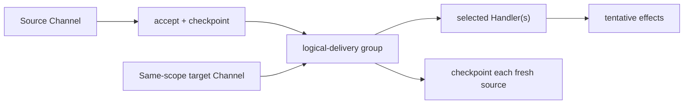

# Channels, Handlers, And Logical Deliveries

An External Channel is the source of an external occurrence. It owns
acceptance, payload derivation, checkpoint subject, and checkpoint policy. A
Handler processes an accepted payload. The Handler may be selected through the
source Channel itself or through another read-only Channel in the same scope.



The target Channel is dispatch metadata. It is not accepted or checkpointed
unless it also participates independently as an external source.

## Classification before execution

For every evidence-selected source the kernel preserves:

```text
sourceChannelKey
handlerChannelKey
logicalDeliveryKey
exact payload identity
checkpoint domain and subject
```

Rejected, stale, absent, non-Channel, incomplete-evidence, and undeclared-
access outcomes remain distinct. Provider-backed evidence is verified before
semantic execution and again at the specification-defined stability boundary.

## Grouping

Fresh sources with the same scope and logical-delivery key coalesce only when
they select the same handler Channel and exact payload. The handlers then run
once, while every participating source retains its own pending checkpoint.
Any disagreement fails the whole invocation atomically.

This separation prevents a target Channel from accidentally acquiring source
authority and prevents repeated handler execution when several equivalent
sources describe one logical delivery.

For fragmented inputs and sparse feeder evidence, continue with
[Fragmented processing and logical delivery](../fragmented-processing-and-logical-delivery.md).
