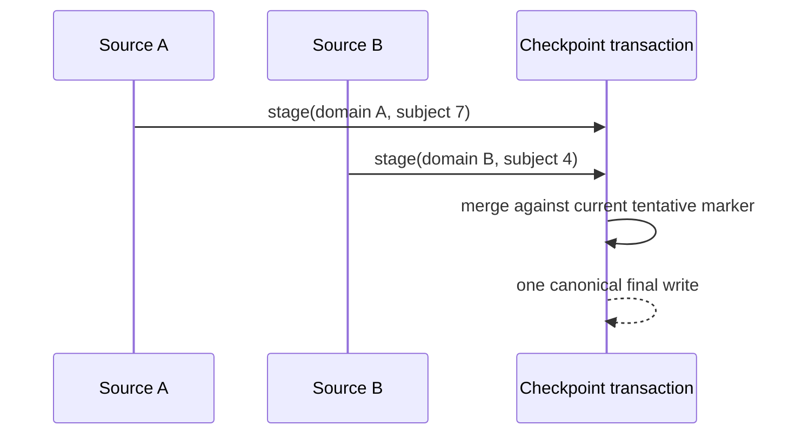

# Checkpoints

A checkpoint belongs to a raw source Channel, not to a target Channel or a
logical-delivery group. Its key combines the raw source key with the exact
checkpoint domain derived from the source's effective subscription and declared
same-scope dependencies.

## Stale gating

Acceptance and checkpoint newness are separate. An accepted occurrence that is
not newer than its stored subject is stale and cannot initialize a scope or run
a handler. A semantically replaced source receives a new domain and therefore
does not inherit stale state from the prior source.

## Transaction rules

Pending writes from all successful logical deliveries are merged against the
current tentative checkpoint state, coalesced, and ordered deterministically.
No later write is rebuilt from an old contract snapshot, so it cannot erase an
earlier pending entry. Cleanup is processor-managed and produces no Document
Update.

Checkpoint comparison and writing occur only at their explicit phase
boundaries. A noncommitting result publishes no checkpoint change. Repeating an
uncertain host commit with the same exact input is idempotent when the host uses
the platform commit companion.
