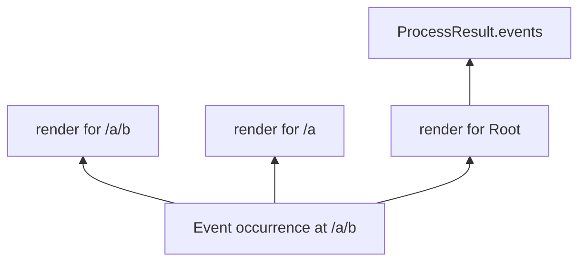

# Events And Document Updates

The processor treats an event occurrence separately from its scope-relative
rendering. One immutable occurrence records the exact event, origin scope,
frozen ancestor propagation chain, and monotonic invocation sequence.

Only events emitted at Root enter `ProcessResult.events`. Descendant events
travel along the ancestor chain frozen when they were emitted. Replacing a
scope later cannot redirect an in-flight occurrence.

## Document Updates

Every semantic change creates a Document Update occurrence from the exact
before and after values. Its operation is determined only by presence:

| Before | After | Operation |
| --- | --- | --- |
| absent | present | `add` |
| present | present | `replace` |
| present | absent | `remove` |
| same exact identity | same exact identity | no update |

The occurrence retains absolute paths and exact values; a receiving scope gets
a deterministic relative rendering. Processor-managed initialization,
checkpoint cleanup, and lifecycle bookkeeping follow their own specification
rules and do not invent application-visible updates.

Effects are buffered per handler execution. The processor checks active-scope
cut-off after nested cascades and before each write. Unapplied effects are
discarded, while occurrences already emitted continue along their frozen
chains.
