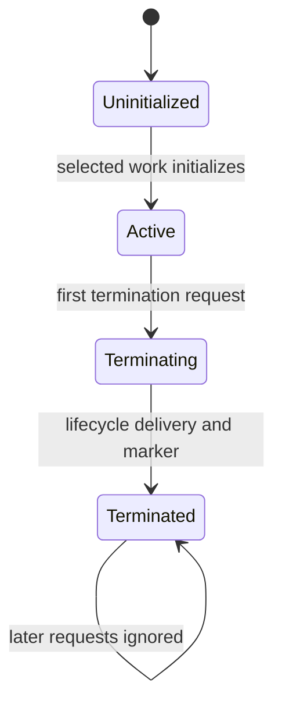

# Processing Lifecycle

Each participating scope has an invocation-local lifecycle:

An already terminated input scope is recognized before application contracts.
Rejected and stale-only deliveries do not initialize. Where a runtime needs an
executable body, body admission completes before initialization so a missing or
invalid body cannot leave lifecycle state behind.

Initialization proceeds top-down through the participating closure. The marker
captures the exact initial scope document, inline or reference-equivalent, and
the initiation event/marker flow occurs once.

Termination is successful business termination, not an error recovery tool.
The first request wins; later requests do nothing. A runtime exception rolls
back instead of writing a fatal termination marker. Root termination does not
erase descendant event occurrences that were already emitted.

Replacing or removing an active scope is cut-off, not termination. Cut-off
blocks subsequent writes, checkpoints, and markers into that occurrence, and
re-adding the same path creates a different occurrence rather than resurrecting
the old one.
