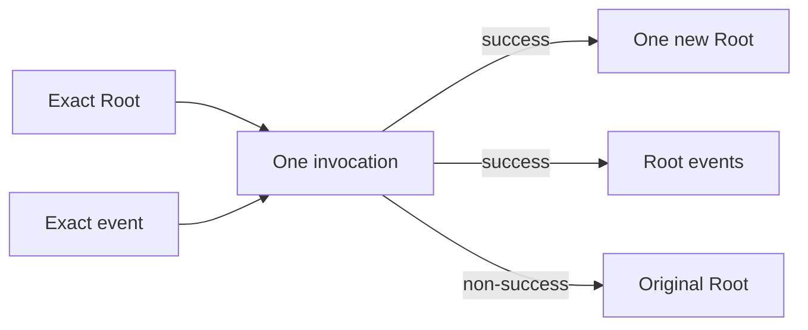

# One-Root Contracts

The Contracts kernel evaluates exactly two semantic inputs:

```text
PROCESS(Root, event) -> ProcessResult
```

`Root` is the only authoritative document. Embedded scopes are owned parts of
that same value; they are not independent sessions or commits. A successful
invocation publishes one replacement Root and zero or more Root events. Every
non-success result retains the input Root and publishes no events.



Pure references, inline nodes, and fragmented provider-backed nodes are
physical representations of the same Blue graph. The processor verifies exact
BlueIds at every provider boundary and bases semantic decisions on resolved,
canonical values. Therefore changing only representation cannot change scope
participation, matching, gas, checkpoints, events, or the resulting Root.

## Atomicity

Patches, lifecycle markers, checkpoints, and subscription changes are staged
inside one invocation transaction. They commit together only after final
soundness and subscription validation. Runtime failure, gas exhaustion,
portable-limit failure, invalid evidence, or scope cut-off cannot leave a
partially updated Root.

Already admitted gas remains visible in a noncommitting result because gas is
an execution trace, not document state.

## Embedded scopes

An effective `Process Embedded` contract declares which owned paths may be
opened as scopes. The processor freezes the participating closure before the
first mutation. A descendant can run before an ancestor, but every mutation is
still applied to the tentative Root. Replacing or removing an active embedded
occurrence cuts off that occurrence and its active descendants; re-adding the
same path does not resurrect the old occurrence.

See [The Contracts pipeline](../architecture/contracts-pipeline.md) and
[Transactional state](../architecture/transactional-state.md) for the phase
and ownership model.
