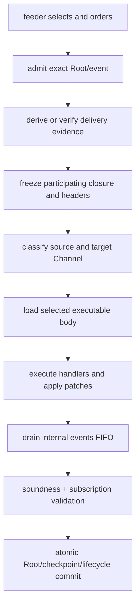

# Contracts processing

The generic kernel evaluates exactly two semantic inputs:

```text
PROCESS(Root, event) -> ProcessResult
```

Root is one exact authoritative document. Embedded scopes are owned paths in
that Root, not separate sessions. Only success publishes a replacement Root
and Root-scope events.

## One invocation



Every phase receives immutable input and owns one deterministic failure
boundary. Executable bodies remain cold until selected. Patches rebuild changed
spines persistently. Internal events can trigger more work, but only Root
emissions cross the output boundary.

## Feeder and processor

The feeder watches the finite subscription surface, obtains external events,
and orders candidate occurrences. It does not decide semantic acceptance or
handler behavior. Revision-complete delivery evidence lets the processor prove
that the occurrence belongs to the exact Root/registry generation.

The processor returns a semantic result. Platform delivery progress and an
external subscription index are committed through a separate companion when a
host needs one atomic database transaction.

## Source and target Channels

A source External Channel can accept an event and select a different
same-scope target Channel:

```text
source "inbox" accepts and owns checkpoint
target "orders" selects handlers
matching handlers execute once for one logical delivery group
```

The target is read-only for this classification unless it independently
participates as an external source. Dependency declarations freeze the exact
target header or bounded catalog used by event-time routing.

## Result atomicity

Success commits patches, lifecycle markers, checkpoints, snapshot publication,
subscription changes, and Root events together. No-match, stale, terminated,
invalid input, runtime failure, gas exhaustion, portable-limit failure, and
subscription-surface failure publish no partial application state. Admitted
gas remains visible because it records work already performed.

Run `CustomRuntimeTypesExample`, `RootOnlyEventsExample`, and
`FragmentedProcessingExample` from `:examples`. See the
[Contracts pipeline](../architecture/contracts-pipeline.md).
