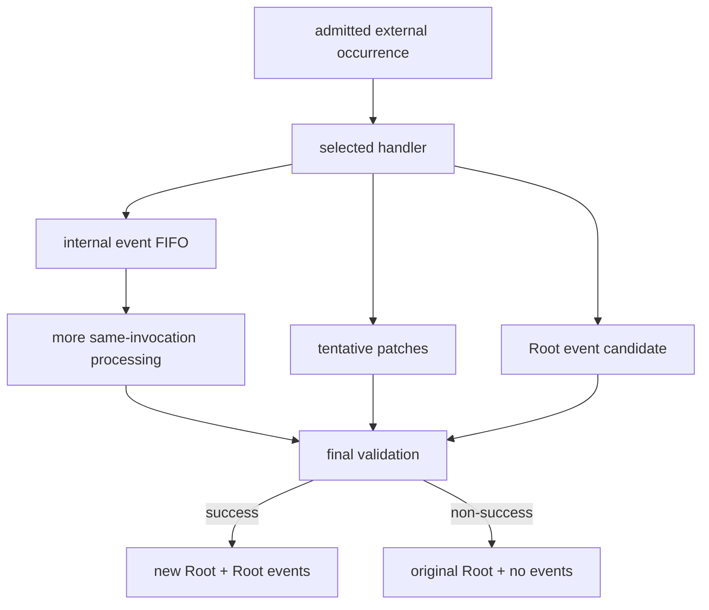
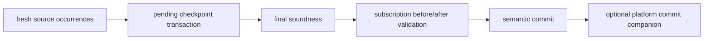

# Events, updates, checkpoints, and lifecycle

Contracts expresses change through exact patches and occurrences inside one
invocation transaction.

## Event flow

An event emitted by an embedded scope is internal. It can participate in the
same invocation but is never returned as an external output. The Root output
collector is the only publication boundary.

## Document Updates

Patches are validated, ordered, and applied persistently. The processor derives
exact Document Update values where the specification requires them; extensions
do not write processor-owned update state directly. Protected lifecycle,
checkpoint, and embedded-scope fields reject unauthorized patches.

## Checkpoints

Each accepted fresh external source occurrence owns a checkpoint domain and
subject. Logical delivery may execute target handlers once for several source
members, but every participating source contributes its own pending checkpoint.
Those writes become authoritative only after handler execution and internal
drain complete successfully.

## Lifecycle and cut-off

Initialization and termination markers are direct processor state. The
participating closure is fixed before mutation. Replacing/removing an active
embedded occurrence cuts off that occurrence and active descendants; adding a
new value at the same path does not resurrect the previous occurrence.

Run `RootOnlyEventsExample` from `:examples`. See
[Transactional state](../architecture/transactional-state.md) and the focused
concept guides for [events](../concepts/events-and-document-updates.md),
[checkpoints](../concepts/checkpoints.md), and [lifecycle](../concepts/lifecycle.md).
