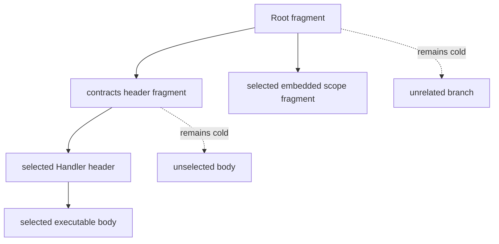

# Fragmented Processing

Fragmentation keeps exact Blue subtrees behind pure references so the processor
can acquire only the participating closure and selected executable bodies. It
does not create partial identities or a second document model.

## Procedure

1. Store each complete exact fragment under its calculated BlueId.
2. Replace an inline edge with `{blueId: exactChildBlueId}`.
3. Configure a verified `NodeProvider`/`ProcessingSnapshotManager`.
4. Supply revision-complete external-delivery evidence or a deterministic
   deriver.
5. Call `processAttempt` and fulfill exact resource requests until a completed
   result is available.
6. Compare the completed output and gas trace with the inline form in tests.

The processor opens contract contributions and effective type headers needed
for the initial participating closure. It does not fetch unselected executable
bodies or unrelated document branches merely because their references are
visible.

Mutation uses persistent changed-spine rebuilding: changed nodes and ancestors
to Root receive new exact identities; untouched siblings retain theirs.
Patching below an opaque cyclic-member edge is rejected before provider demand,
while replacement of the whole permitted edge remains possible.

For the complete evidence and logical-delivery model, see
[Fragmented processing and logical delivery](../fragmented-processing-and-logical-delivery.md).
