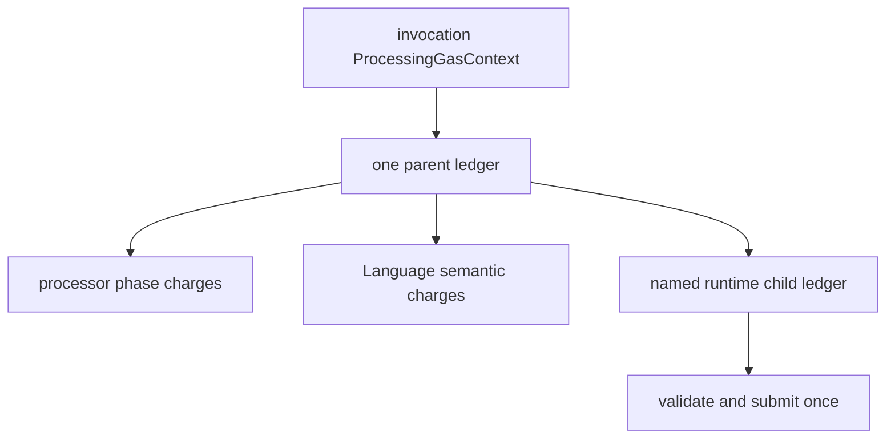

# Gas and runtime work

Portable gas is the deterministic ordered trace of semantic work for one
invocation. It is bound by the released gas manifest and is independent of
machine performance.

```text
same Root + event + exact evidence + registry + gas manifest
    => same counter sequence, quantities, weights, subtotals, and total
```

## Ledger ownership



A charge is admitted before its associated work. If the next charge would
cross the limit, that charge is absent and the result retains the exact
admitted prefix. A child ledger belongs to the current invocation, uses a
declared namespace/counter vocabulary, and can merge exactly once.

## What is portable

Portable counters cover identity blocks, list folds, text/integer work,
members, comparisons, validation, type edges, selected deliveries, patches,
events, lifecycle, checkpoints, and bounded runtime work.

These are host metrics and never gas:

- provider/backend calls and bytes;
- cache hits, misses, evictions, or retained weight;
- wall-clock or CPU time;
- allocation, threads, locks, batching, and scheduling;
- observer/JFR/Micrometer activity.

## Portable limits

A portable limit bounds one structural/cardinality dimension such as pointer
depth, direct container width, participating scopes, event queue, patch count,
or child-ledger shape. More gas cannot repair a portable-limit failure. The
diagnostic identifies the bound name, observed value, and limit.

Run
[`RuntimeChildGasLedgerExample`](../../examples/src/main/java/blue/language/examples/RuntimeChildGasLedgerExample.java)
from `:examples`. The generated counter catalog is
[gas-counters.md](../reference/gas-counters.md); operational metrics are listed
in [host-metrics.md](../reference/host-metrics.md).
