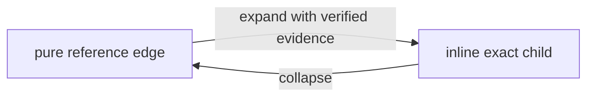
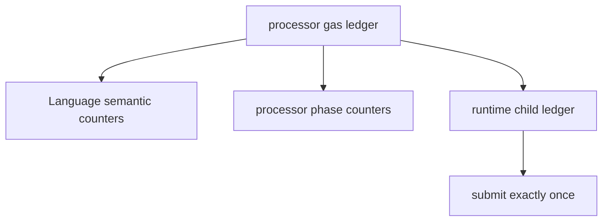

# Start here: the Blue mental model

This guide builds the complete model from a scalar value to deterministic
Contracts processing. It is intentionally runtime-neutral. Follow the links at
the end when you need exact Java APIs, provider implementation details, or
release procedures.

## 1. Values and nodes

Blue uses the JSON value model: text, integer, finite double, boolean, list,
and object. Java represents an authored or transported value as a mutable
`Node`.

```yaml
name: Greeting
value: hello
```

`name`, `description`, `type`, and `schema` are Blue metadata. Other object
keys are ordinary properties. A node has at most one payload shape: scalar,
list, or object.

The mutable Java object is not the semantic identity. Runtime operations copy
or freeze it, and returned mutable nodes belong to the caller.

## 2. Blue is a graph, not a tree

A pure reference contains only a BlueId:

```yaml
blueId: 7i7D...exactBase58Value
```

That edge can point to content used in many places. References, shared types,
and finalized cyclic sets make the logical value a graph. A YAML or JSON
document is only one slice or representation of that graph.

```text
document slice --pure reference--> exact node
       |                              ^
       +----------another edge-------+
```

Provider calls and physical fragments retrieve graph evidence. They do not
create a second value model.

## 3. One BlueId and pure references

Blue has one BlueId format and algorithm. There are two preparation paths:

```text
exact node --------------------------------------> direct BlueId

Source -> preprocess -> resolve -> canonicalize -> direct BlueId
```

The first path accepts exact identity input. The second accepts human-friendly
Source and produces exact canonical input before running the same final
calculation. “Content BlueId” is shorthand for this identifier, not another
kind of ID.

A BlueId is about identity, not storage. It does not say where bytes live,
whether a provider is online, whether a value is cached, or which fragment
contains it.

## 4. Types and specialization

A type is an ordinary exact Blue node referenced by BlueId. An instance can
use a pure type reference:

```yaml
type:
  blueId: 4abc...personType
name: Ada
```

Resolution combines type-derived values and local values under the Language
merge rules. Specialization is a construction operation: it combines a type
and overlay to create a new node. It may therefore create a new BlueId.

Expansion is different. It replaces references with exact content while
preserving the same node and BlueId. Keep this distinction:

```text
expand     = same node, more materialized representation
specialize = new node constructed from type plus overlay
```

## 5. Expansion and collapse

Suppose a child is stored separately:

```yaml
child:
  blueId: 9xyz...child
```

Expansion verifies and inserts the referenced exact child. Collapse replaces
an eligible exact subtree with its pure reference. Both preserve the enclosing
identity.



Strict expansion requires complete evidence. A limited operation reports an
exhaustive outcome; it never treats an unavailable provider as proof of
absence.

## 6. The `blue` preprocessing directive

Source may carry one root `blue` directive containing imports and ordered
transformations:

```yaml
blue:
  imports:
    Message:
      blueId: 8msg...textType
  transformations:
    - type:
        blueId: 2first...transform
    - type:
        blueId: 3second...transform
type: Message
value: hello
```

The order is exact:

1. resolve and validate the directive, imports, and transformations;
2. remove `blue` from a cloned Source;
3. run transformations once in declaration order;
4. run baseline wrapper normalization, alias substitution, primitive
   inference, and final validation.

All preflight completes before the first transformation. The baseline is a
mandatory algorithm stage, not an implicit directive.

## 7. Resolution establishes complete meaning

Resolution follows verified types and references, then applies merge and
schema rules. It answers “what is the complete value?”

```yaml
# type contributes
enabled: true
items: [A, B]

# instance contributes
items: [C]

# resolved meaning
enabled: true
items: [A, B, C]
```

Complete resolution can establish semantic absence. A transport miss or an
exhausted traversal budget alone cannot.

## 8. Canonicalization versus minimization

Canonicalization answers “what unique exact value is hashed?” Minimization
answers “what compact ordinary Source resolves to the same meaning?”

For an object, canonicalization materializes identity-bearing inherited data;
minimization may omit data already supplied by the type. For an append-only
list:

```text
Inherited  [A, B]
Resolved   [A, B, C]
Minimized  $previous(id([A, B])) + C
Canonical  [A, B, C]
```

Source Document BlueId uses canonicalization, not minimization. A minimized
overlay is Source and must be processed again before direct calculation.

## 9. List identity and incremental work

List identity is one domain-separated recursive prefix fold. Here `H` is the
normal direct BlueId hash over RFC 8785 canonical JSON, and `id(elementN)` is
the exact BlueId of that element:

```text
L0 = H({"$list":"empty"})
Ln = H({"$listCons":{
       "elem":{"blueId":id(elementN)},
       "prev":{"blueId":Ln-1}
     }})
id([a1, ..., an]) = Ln
```

RFC 8785 serializes the fold map as `elem` before `prev`; neither Java map
insertion order nor another host language's object order is semantic.

If the BlueId for `[A, B]` is established, appending `C` performs one fold
step with that prefix identity and `id(C)`. It does not need the bodies of A or
B. This makes append work O(delta).

Editing an earlier element keeps the accumulator immediately before the edit,
then recomputes that element and every following suffix step. Identity does not
imply that the earlier bodies are stored together.

## 10. Schemas and unconstrained fields

These declarations mean different things:

```yaml
# no type: any Blue value is allowed
payload:
  description: Runtime-defined payload
```

```yaml
# Dictionary: an object value is required
payload:
  type: Dictionary
```

```yaml
# required but otherwise unconstrained
schema:
  required: [payload]
payload:
  description: Must exist; its value shape is open
```

No type is not the same as Dictionary. `required` controls presence, not the
shape of an unconstrained value.

## 11. Providers and immutable snapshots

A typed provider outcome distinguishes:

- `FOUND`: candidate evidence is available;
- `NOT_FOUND`: the provider definitively has none;
- `UNAVAILABLE`: the answer cannot currently be established;
- `INVALID_EVIDENCE`: content or proof failed verification.

The Language boundary verifies identity, Source environment, fragments, and
cyclic proofs before admitting a value. A `ResolvedSnapshot` retains immutable
canonical and resolved roots. Mutable accessors return detached copies.

Snapshots let matching, patching, and Contracts reuse established evidence
without making cache state semantic. Warm and cold executions must agree.

## 12. Contracts expresses deterministic time and change

Language establishes meaning and identity. Contracts adds a deterministic
state transition:

```text
PROCESS(Root, event) -> status, Root, Root events, gas, diagnostic?
```

The event is the proposed occurrence of time/change. Contracts in Root decide
whether to accept it and which patches or events to produce. Only `success`
commits. Every other completed status returns the exact input Root and no Root
events.

## 13. Feeder versus processor

The feeder watches the finite external subscription surface, obtains external
events, orders candidate occurrences, and supplies exact delivery evidence.
The processor remains the semantic authority:

```text
feeder selects and orders
processor preflights the participating closure
selected executable body loads
patches rebuild the changed spine
internal events drain
Root events are returned
Root/checkpoints/lifecycle commit atomically
```

Feeder indexes and transport progress are platform state. They do not become a
third authored input to `PROCESS`.

An indexed host can make that boundary explicit. It first asks the public
indexed-delivery evaluator to verify the complete retained interval surface and
the ordered physical candidate set. It then passes the resulting exact plan,
together with one request-local provider, through
`PlatformProcessInvocation` to `BlueContracts.processForPlatformCommit(...)`.

```text
semantic inputs:       Root + event
execution environment: exact verified plan + invocation provider
host result:           PROCESS result + atomic commit companion
```

Contracts binds the plan back to the exact Root BlueId, event BlueId, managed
and indexed revision, event order, and immutable runtime-registry generation.
It also replays the complete supplied plan through the authoritative verifier.
Supplying a prepared plan avoids acquiring the same environmental state again;
it never turns that plan into trusted semantic input and never bypasses
verification.

The invocation provider is the complete provider graph for that attempt. It is
used for Root/event admission, selected embedded scopes, contract and type
chains, selected Channel and Handler content, patch opening, and final
subscription validation. Language verifies its returned nodes but does not add
the service provider, bootstrap provider, or a prior invocation's cache as a
fallback. The caller composes any intended fallback explicitly. Closing the
invocation releases only invocation-owned state and never closes that borrowed
provider.

## 14. One Root and embedded scopes

An embedded scope is an owned object path declared by an effective Process
Embedded contract. It is not an independent document or commit.

```yaml
name: Root
counter: 0
child:
  counter: 0
contracts:
  embedded:
    type: Process Embedded
    paths: [/child]
```

The two declaration forms have deliberately different meanings:

```text
paths:           one exact child scope per normalized pointer
collectionPaths: every present direct stable-key object member is a child scope
```

For example, `collectionPaths: [/lessons]` selects
`/lessons/lesson-a` and `/lessons/lesson-b`; it does not select the
`/lessons` container. There are no wildcards, implicit List items,
`/contracts/...` scopes, or inherited parent Channels. Each selected child
must carry its own exact local bindings. The same exact child or Channel
BlueId can be reused at two keys, but the keys name independent owned
occurrences.

The participating closure is frozen before mutation. Child work may run in a
deterministic order, but all patches apply to one tentative Root. If an active
scope occurrence is replaced or removed, that occurrence and its descendants
are cut off.

A member created during an event is therefore not processed by that event. A
successful commit publishes a subscription delta whose lower boundary is the
creating event; the new member can receive the next eligible event. Replacing
a parent Channel does not rewrite existing children, while a later-created
child may explicitly reuse the new exact Channel value. Concrete targeting is
still defined by the selected Channel runtime, not by `collectionPaths`.

Internal child events are drained inside the invocation. Only events emitted
by Root are returned to the caller.

## 15. Channels and handlers

An External Channel is a source of accepted external occurrences. Its event
may select a different same-scope target Channel for handler matching:

```text
source Channel "inbox" accepts event
event selects target Channel "orders"
handlers bound to "orders" match and execute once
source "inbox" remains checkpoint owner
```

Source classification, target selection, handler matching, and checkpoint
ownership are distinct immutable decisions. A target is not evaluated as an
external source unless it independently participates as one.

## 16. Gas and representation invariance

Portable gas is the ordered, named trace of semantic work. A child runtime
opens a named ledger, charges manifest-bound counters, and merges it once into
the invocation budget.



Provider calls, bytes, cache hits, timings, and threads are host metrics, never
portable gas. Inline/reference, warm/cold, fragmented/whole, and batched/
unbatched forms must produce the same semantic demand and gas trace.

Portable limits are different from gas. They bound one structural dimension.
More gas cannot repair a portable-limit failure.

## Where to go next

- [Nodes, graphs, and BlueIds](guides/nodes-graphs-and-blueids.md)
- [Preprocessing and the `blue` directive](guides/preprocessing-and-blue-directive.md)
- [Resolve, canonicalize, and minimize](guides/expand-collapse-resolve-canonicalize-minimize.md)
- [Providers and evidence](guides/providers-and-evidence.md)
- [Runtime projection and indexed delivery](guides/runtime-projection-and-indexed-delivery.md)
- [Contracts processing](guides/contracts-processing.md)
- [Embedded collection paths](guides/embedded-collection-paths.md)
- [Collection-paths migration report](collection-paths-and-cohesion-migration-report.md)
- [Platform invocation and pure-reference correction report](platform-invocation-and-pure-reference-release-report.md)
- [Statuses and diagnostics](reference/statuses-and-diagnostics.md)
- [Architecture overview](architecture/overview.md)
- [Developer process](developer-process.md)

Runnable Java versions of the examples live in `:examples` and are executed by
its test suite. The generated [public API reference](reference/public-api.md)
and package Javadocs identify the exact Java entry points.
